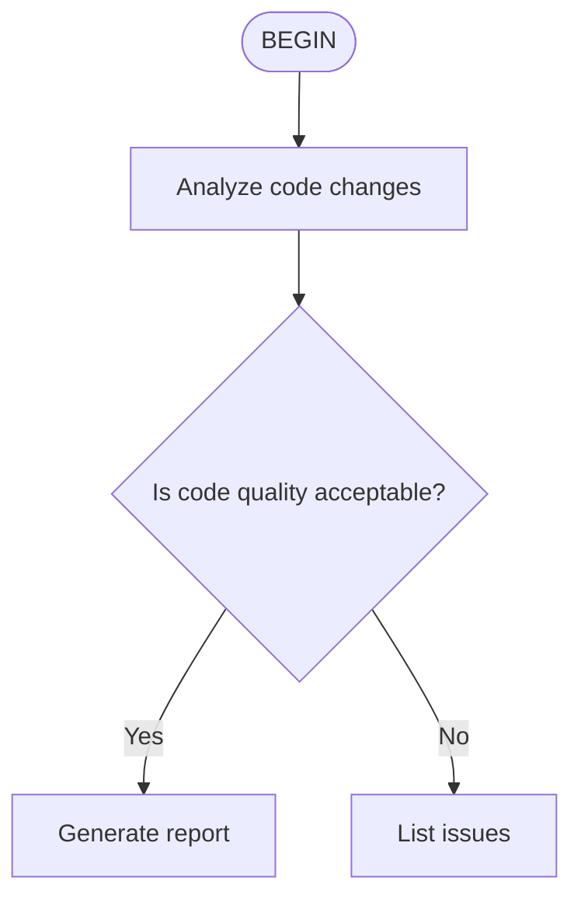

# GitHub Pages Setup Analysis: kimi-cli Reference Implementation

## Executive Summary

The kimi-cli project uses **VitePress** (not Jekyll) as its static site generator for GitHub Pages documentation. This is a modern, Vue-powered documentation framework with excellent developer experience.

---

## 1. Static Site Generator: VitePress

**Version**: 1.5.0

**Why VitePress over Jekyll**:
- Modern Vue.js-based framework
- Fast hot-reload during development
- Built-in Vue component support
- Excellent TypeScript support
- Markdown enhancements with containers
- Better performance (Vite-powered)

---

## 2. Directory Structure

```
docs/
├── .vitepress/
│   ├── config.ts          # Main configuration (8.5KB)
│   └── theme/
│       ├── index.ts       # Theme entry (extends default)
│       └── style.css      # Custom brand colors
├── en/                    # English documentation
│   ├── index.md           # Language landing page
│   ├── faq.md             # FAQ
│   ├── configuration/     # Configuration docs
│   ├── customization/     # Customization docs
│   ├── guides/            # Getting started guides
│   ├── reference/         # API/command reference
│   └── release-notes/     # Changelog, breaking changes
├── zh/                    # Chinese documentation (mirrored structure)
├── media/                 # Images, GIFs (4.7MB total)
│   ├── acp-integration.gif
│   ├── setup.jpg
│   ├── shell-mode.gif
│   └── vscode.png
├── scripts/
│   └── sync-changelog.mjs # Syncs root CHANGELOG.md to docs
├── index.md               # Root redirect (language detection)
├── package.json           # Dependencies
└── bun.lock               # Lockfile
```

---

## 3. Configuration Details

### package.json Dependencies

```json
{
  "devDependencies": {
    "vitepress": "^1.5.0"
  },
  "dependencies": {
    "mermaid": "^11.12.2",
    "vitepress-plugin-llms": "^1.10.0",
    "vitepress-plugin-mermaid": "^2.0.17"
  }
}
```

### Key Plugins

1. **vitepress-plugin-mermaid**: Renders Mermaid diagrams inline
2. **vitepress-plugin-llms**: Generates AI-friendly documentation (llms.txt)

### Build Scripts

```json
{
  "sync": "node scripts/sync-changelog.mjs",
  "dev": "npm run sync && vitepress dev",
  "build": "npm run sync && vitepress build",
  "preview": "vitepress preview"
}
```

---

## 4. VitePress Configuration (`config.ts`)

### Base Path Handling

```typescript
const rawBase = process.env.VITEPRESS_BASE
const base = rawBase
  ? rawBase.startsWith('/')
    ? rawBase.endsWith('/') ? rawBase : `${rawBase}/`
    : `/${rawBase}/`
  : '/'
```

### Multi-Language Setup

Two locales configured:
- **English (`en`)**: `/en/` path prefix
- **Chinese (`zh`)**: `/zh/` path prefix

Each locale has:
- Separate navigation
- Separate sidebars
- Localized titles/descriptions

### Navigation Structure

```
Guides → Customization → Configuration → Reference → FAQ → Release Notes
```

### Sidebar Organization

Path-based sidebars:
- `/en/guides/` → Guide pages
- `/en/customization/` → Customization pages
- `/en/configuration/` → Configuration pages
- `/en/reference/` → Reference pages
- `/en/release-notes/` → Release notes

### Theme Features

```typescript
themeConfig: {
  outline: [2, 3],          // H2 and H3 in page outline
  search: { provider: 'local' },  // Built-in local search
  socialLinks: [
    { icon: 'github', link: 'https://github.com/MoonshotAI/kimi-cli' }
  ]
}
```

---

## 5. Theme Customization

### Theme Entry (`theme/index.ts`)

```typescript
import DefaultTheme from 'vitepress/theme'
import './style.css'
export default DefaultTheme
```

Simple extension of the default VitePress theme with custom styles.

### Brand Colors (`theme/style.css`)

```css
:root {
  --vp-c-brand-1: rgb(52, 118, 246);   /* Primary blue */
  --vp-c-brand-2: rgb(72, 138, 255);
  --vp-c-brand-3: rgb(92, 158, 255);
  --vp-c-brand-soft: rgba(52, 118, 246, 0.14);
}

.dark {
  /* Dark mode overrides */
}
```

CSS custom properties for brand colors - minimal customization.

---

## 6. Advanced Features

### Mermaid Diagram Support

Used in `skills.md` for flow diagrams:

```markdown

```

### Language Auto-Detection

Root `index.md` uses Vue script to detect browser language:

```vue
<script setup>
import { onMounted } from 'vue'
import { useRouter } from 'vitepress'

onMounted(() => {
  const router = useRouter()
  const lang = navigator.language || navigator.userLanguage
  if (lang.startsWith('zh')) {
    router.go('/zh/')
  } else {
    router.go('/en/')
  }
})
</script>
```

### Home Page Layout

English landing page uses `layout: home` with hero:

```yaml
---
layout: home
hero:
  name: Kimi Code CLI
  text: Intelligent Command Line Assistant
  tagline: Technical Preview
  actions:
    - theme: brand
      text: Getting Started
      link: /en/guides/getting-started
    - theme: alt
      text: GitHub
      link: https://github.com/MoonshotAI/kimi-cli
---
```

### VitePress Containers

Uses built-in container syntax for tips, warnings, info:

```markdown
::: tip
This is a tip
:::

::: warning
This is a warning
:::

::: info Added
Added in version 1.1
:::
```

---

## 7. Documentation Content Patterns

### Getting Started Structure

1. **What is** - Introduction and value proposition
2. **Installation** - Platform-specific install commands
3. **Upgrade/Uninstall** - Maintenance commands
4. **First run** - Quick start guide with code blocks

### FAQ Structure

Organized by topic categories:
- Installation and authentication
- Interaction issues
- ACP issues
- MCP issues
- Print/Wire mode issues
- Updates and upgrades

### Reference Documentation

Each command gets its own page:
- `kimi-command.md` - Main command
- `kimi-info.md` - Info subcommand
- `kimi-acp.md` - ACP subcommand
- etc.

---

## 8. Build & Deployment

### GitHub Pages Workflow

The docs are built and deployed via VitePress's built-in output to `.vitepress/dist/`.

### Changelog Sync

Automated script syncs root `CHANGELOG.md` to docs:
- Strips HTML comments
- Reformats version headers
- Removes subsection headers

---

## 9. Design Philosophy

### Visual Aesthetic

- **Clean and minimal**: Default VitePress theme with subtle brand color
- **Documentation-first**: Optimized for reading and navigation
- **Dark mode support**: Proper CSS variable handling for both modes
- **Responsive**: VitePress handles mobile/tablet layouts

### Information Architecture

- **Hierarchical navigation**: Clear section grouping
- **Path-based sidebars**: Context-aware navigation
- **Local search**: Full-text search without external dependencies
- **Multi-language parity**: Complete translation for zh/en

---

## 10. Key Takeaways for go-live

1. **Use VitePress**: Modern, fast, excellent DX
2. **Multi-language ready**: Built-in i18n support
3. **Mermaid for diagrams**: Inline diagram rendering
4. **Minimal theme customization**: Extend defaults, don't rebuild
5. **Automation scripts**: Sync external content into docs
6. **Container syntax**: Use `:::tip`, `:::warning` for callouts
7. **Vue components**: Can embed Vue in markdown for dynamic content
8. **Local search**: No Algolia dependency needed

---

## Files to Reference

- `/home/shuai/Code/kimi-cli/docs/.vitepress/config.ts` - Full configuration
- `/home/shuai/Code/kimi-cli/docs/package.json` - Dependencies
- `/home/shuai/Code/kimi-cli/docs/.vitepress/theme/style.css` - Brand colors
- `/home/shuai/Code/kimi-cli/docs/en/index.md` - Home page pattern
- `/home/shuai/Code/kimi-cli/docs/en/guides/getting-started.md` - Guide pattern
- `/home/shuai/Code/kimi-cli/docs/en/customization/skills.md` - Mermaid usage
