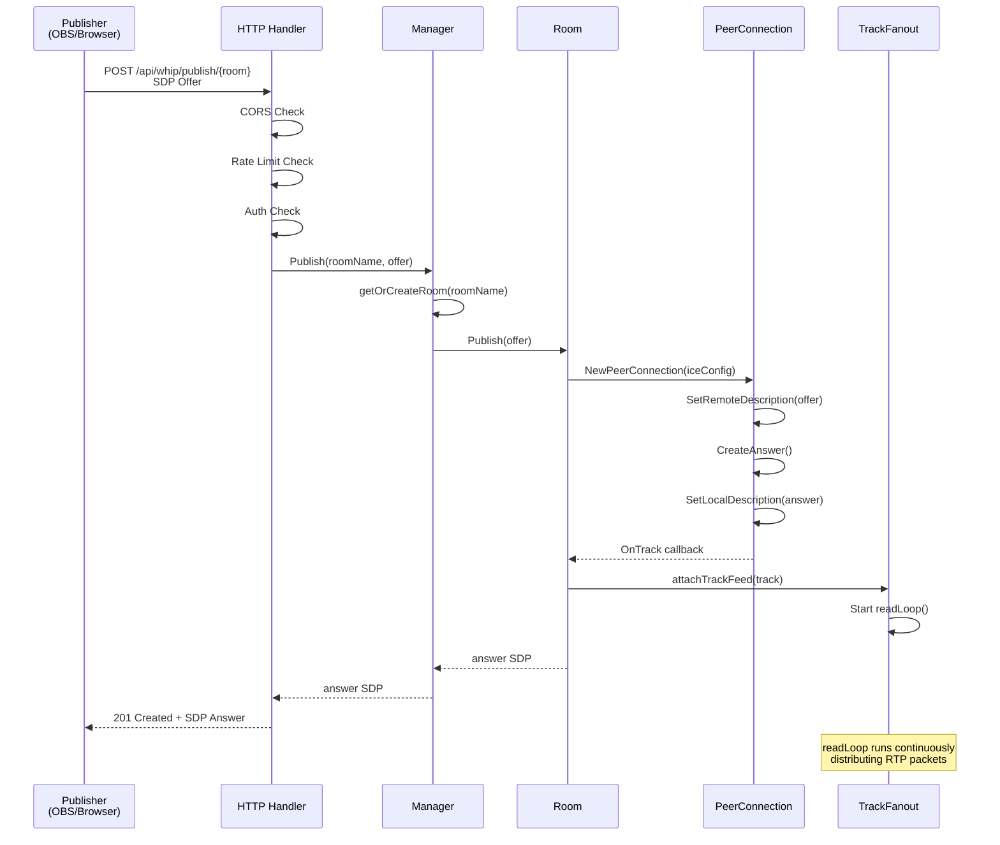
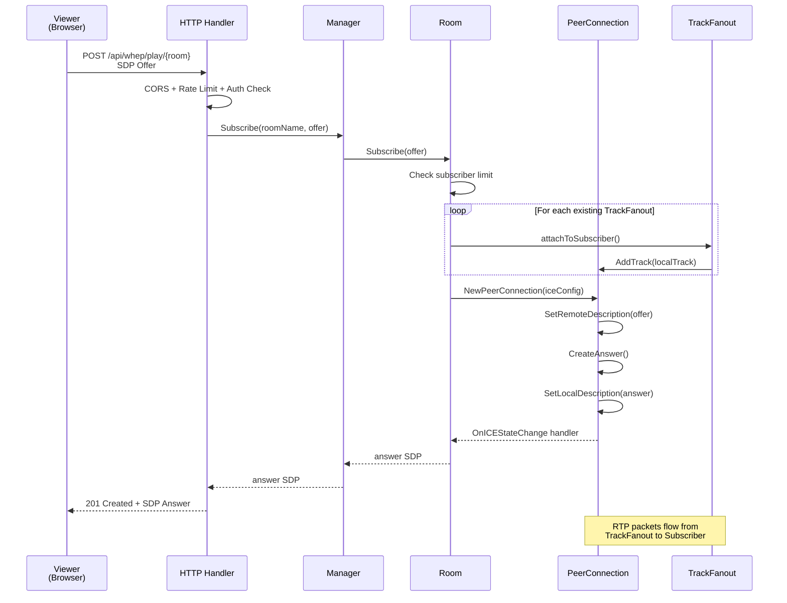
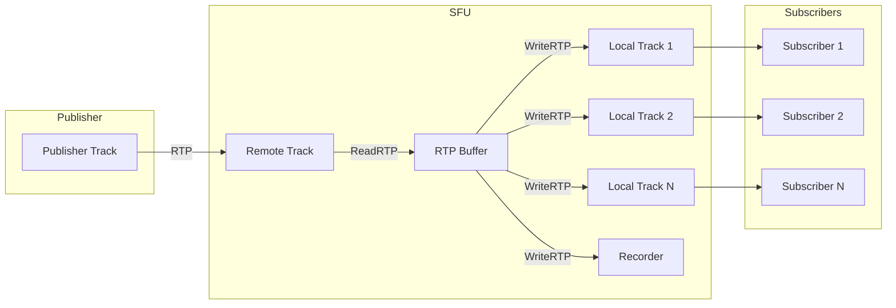
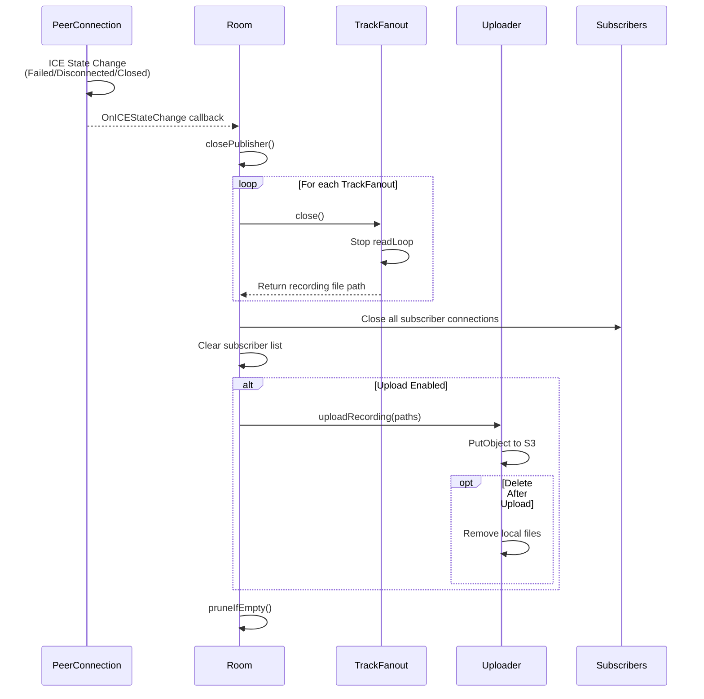
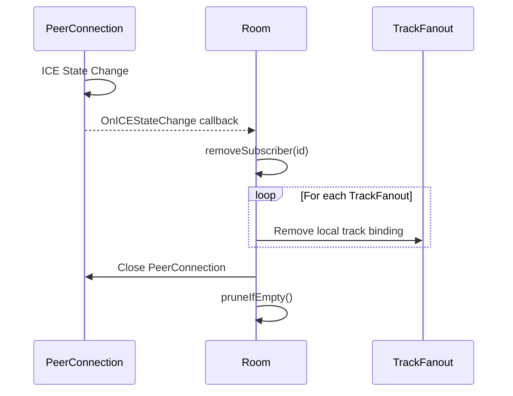
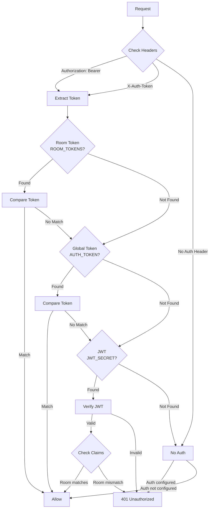
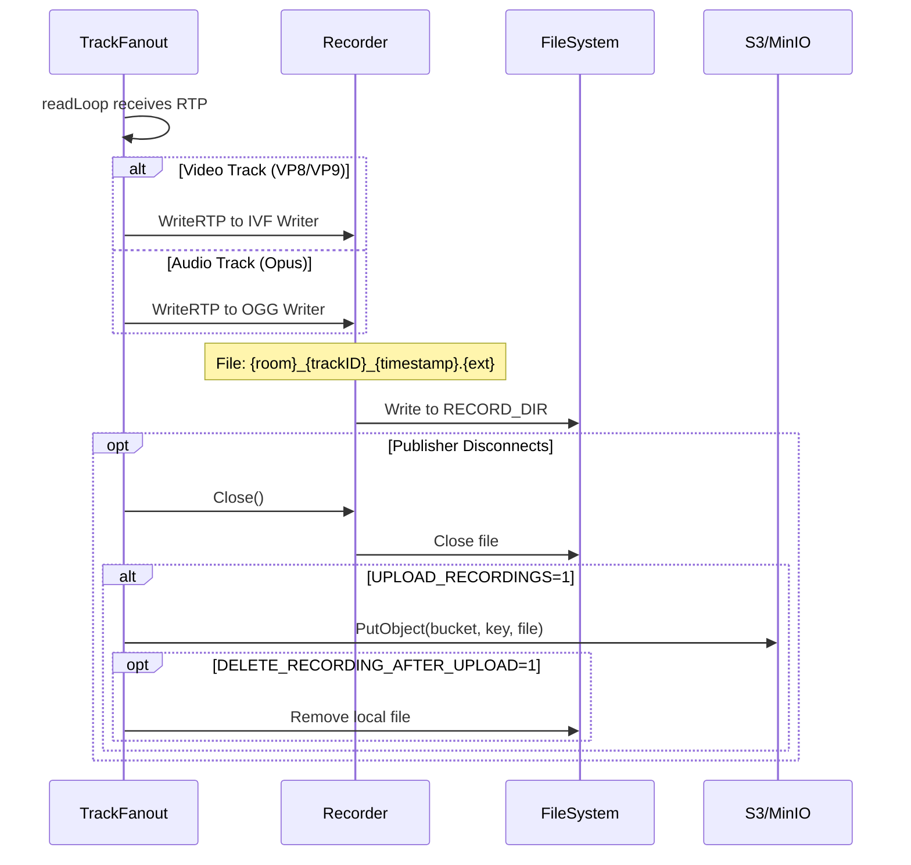

# Data Flow

Detailed documentation of request and data flow through the system.

## WHIP Publishing Flow



## WHEP Playback Flow



## RTP Packet Flow



## Disconnection Flow

### Publisher Disconnect



### Subscriber Disconnect



## Authentication Flow



## Recording Flow



## Metrics Update Flow

```mermaid
flowchart TB
    subgraph RTP["RTP Processing"]
        READ[ReadRTP] --> UPDATE[Update Metrics]
        UPDATE --> DISTRIB[Distribute to Subscribers]
    end

    subgraph Metrics["Prometheus Metrics"]
        UPDATE --> ROOMS[live_rooms Gauge]
        UPDATE --> SUBS[live_subscribers GaugeVec]
        UPDATE --> BYTES[live_rtp_bytes_total CounterVec]
        UPDATE --> PKTS[live_rtp_packets_total CounterVec]
    end

    subgraph Export["Export"]
        ROOMS --> PROM[/metrics endpoint]
        SUBS --> PROM
        BYTES --> PROM
        PKTS --> PROM
    end
```

## Request Rate Limiting

```mermaid
flowchart TB
    REQ[Request] --> IP[Extract Client IP]
    IP --> BUCKET{Token Bucket<br/>Available?}
    
    BUCKET -->|Yes| ALLOW[Allow Request]
    BUCKET -->|No| REJECT[429 Too Many Requests]
    
    ALLOW --> PROCESS[Process Request]
    PROCESS --> UPDATE[Update Bucket<br/>-1 Token]
    
    Note over BUCKET: Refills at RATE_LIMIT_RPS<br/>Burst capacity: RATE_LIMIT_BURST
```
