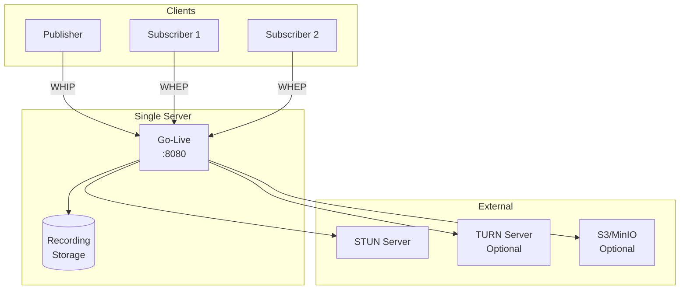
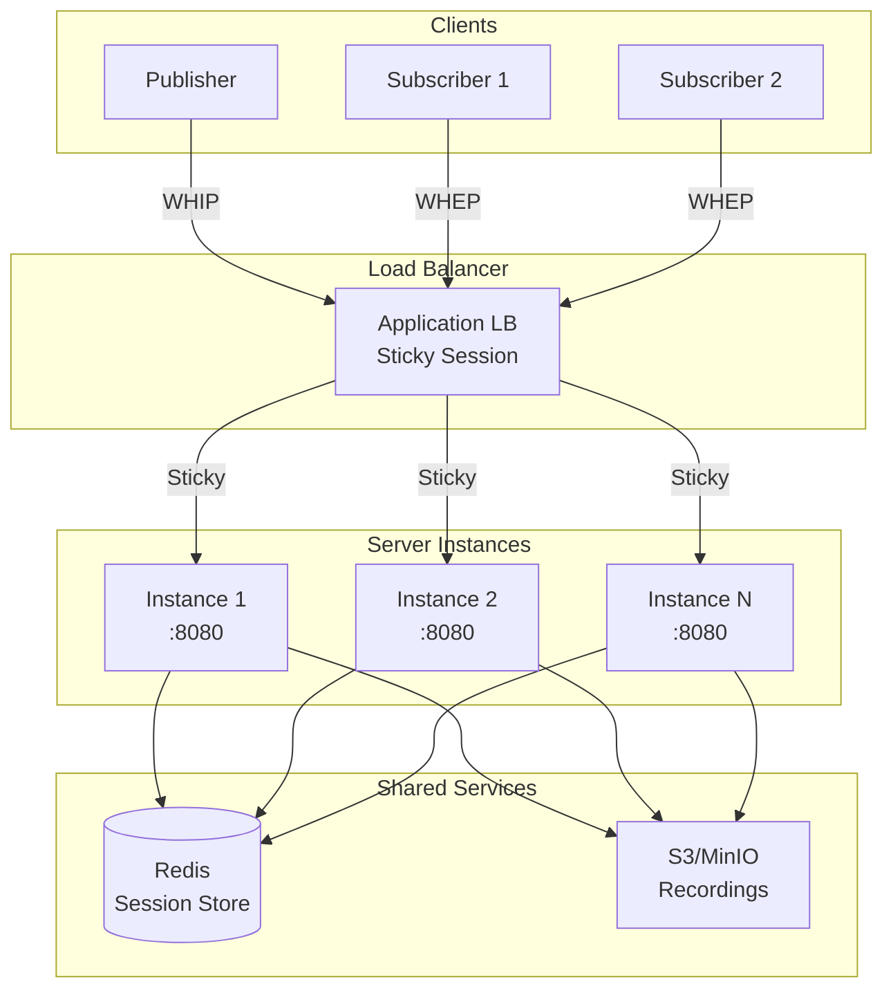
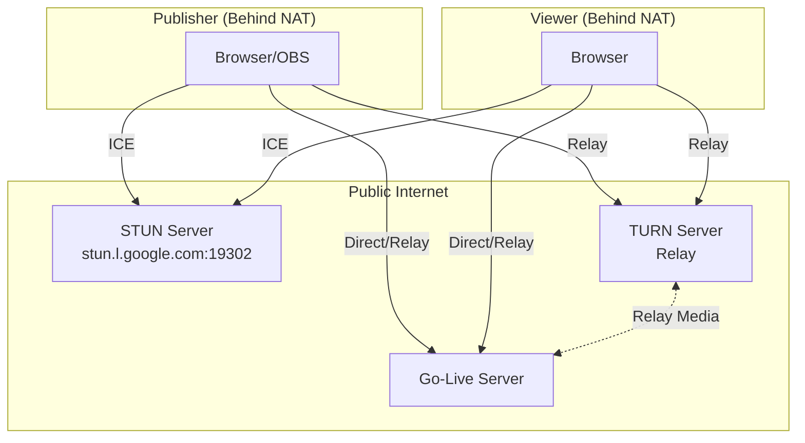
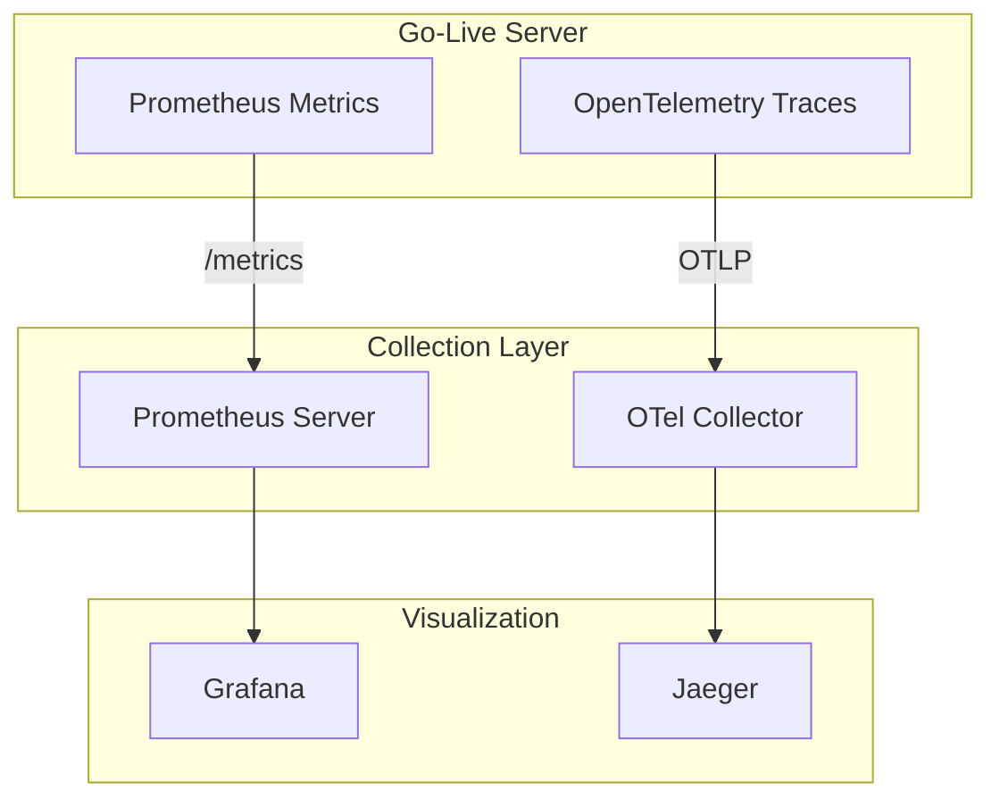

# Deployment Architecture

Deployment patterns and topology options for Go-Live.

## Single Instance Deployment

The simplest deployment pattern, suitable for development and small-scale production.



### Docker Compose

```yaml
version: '3.8'

services:
  live-webrtc:
    image: live-webrtc:latest
    ports:
      - "8080:8080"
    environment:
      - HTTP_ADDR=:8080
      - AUTH_TOKEN=${AUTH_TOKEN}
      - RECORD_ENABLED=1
      - RECORD_DIR=/records
    volumes:
      - ./records:/records
    restart: unless-stopped
```

## Multi-Instance Deployment

For high availability and horizontal scaling.



::: warning
Multi-instance deployment requires session affinity (sticky sessions) because room state is in-memory. All clients for a room must connect to the same instance.
:::

### Kubernetes Deployment

```yaml
apiVersion: apps/v1
kind: Deployment
metadata:
  name: live-webrtc
spec:
  replicas: 3
  selector:
    matchLabels:
      app: live-webrtc
  template:
    metadata:
      labels:
        app: live-webrtc
    spec:
      containers:
      - name: live-webrtc
        image: live-webrtc:latest
        ports:
        - containerPort: 8080
        env:
        - name: HTTP_ADDR
          value: ":8080"
        - name: AUTH_TOKEN
          valueFrom:
            secretKeyRef:
              name: live-webrtc-secret
              key: auth-token
        volumeMounts:
        - name: records
          mountPath: /records
      volumes:
      - name: records
        persistentVolumeClaim:
          claimName: records-pvc
---
apiVersion: v1
kind: Service
metadata:
  name: live-webrtc
spec:
  selector:
    app: live-webrtc
  ports:
  - port: 80
    targetPort: 8080
  type: LoadBalancer
  # Session affinity required for multi-instance
  sessionAffinity: ClientIP
  sessionAffinityConfig:
    clientIP:
      timeoutSeconds: 3600
```

## NAT Traversal

For clients behind NAT, TURN servers are required.



### TURN Configuration

```bash
# Self-hosted TURN (coturn)
TURN_URLS=turn:turn.example.com:3478,turns:turn.example.com:5349
TURN_USERNAME=username
TURN_PASSWORD=password

# Cloud TURN services
# Twilio: Use their STUN/TURN URLs
# Xirsys: Use their ICE servers API
```

## Recording Storage Architecture

```mermaid
flowchart TB
    subgraph Server["Go-Live Server"]
        TF[TrackFanout] --> REC[Recorder]
    end

    subgraph Local["Local Storage"]
        REC --> FS[(Filesystem<br/>RECORD_DIR)]
    end

    subgraph Upload["Upload Flow"]
        FS -->|UPLOAD_RECORDINGS=1| S3[S3/MinIO Client]
        S3 --> BUCKET[(S3 Bucket)]
        
        opt Delete After Upload
            FS -.->|DELETE_RECORDING_AFTER_UPLOAD=1| DEL[Delete Local]
        end
    end
```

### S3/MinIO Configuration

```bash
# AWS S3
S3_ENDPOINT=s3.amazonaws.com
S3_REGION=us-east-1
S3_BUCKET=my-recordings
S3_ACCESS_KEY=$AWS_ACCESS_KEY_ID
S3_SECRET_KEY=$AWS_SECRET_ACCESS_KEY

# MinIO
S3_ENDPOINT=minio.example.com:9000
S3_BUCKET=recordings
S3_ACCESS_KEY=minioadmin
S3_SECRET_KEY=minioadmin
S3_USE_SSL=0
S3_PATH_STYLE=1
```

## Observability Stack



### Prometheus Scrape Config

```yaml
scrape_configs:
  - job_name: 'live-webrtc'
    static_configs:
      - targets: ['live-webrtc:8080']
```

### OpenTelemetry Configuration

```bash
OTEL_EXPORTER_OTLP_ENDPOINT=otel-collector:4317
OTEL_EXPORTER_OTLP_PROTOCOL=grpc
OTEL_SERVICE_NAME=live-webrtc-go
```

## High Availability Considerations

| Component | Single Instance | Multi-Instance |
|-----------|-----------------|----------------|
| Room State | In-memory | Requires Redis sync |
| Recordings | Local filesystem | S3/MinIO |
| Load Balancing | N/A | Sticky sessions required |
| Failover | Manual restart | Automatic (with session loss) |

::: tip
For production multi-instance deployment, consider implementing room state synchronization via Redis or using a signaling layer to redirect clients to the correct instance.
:::
