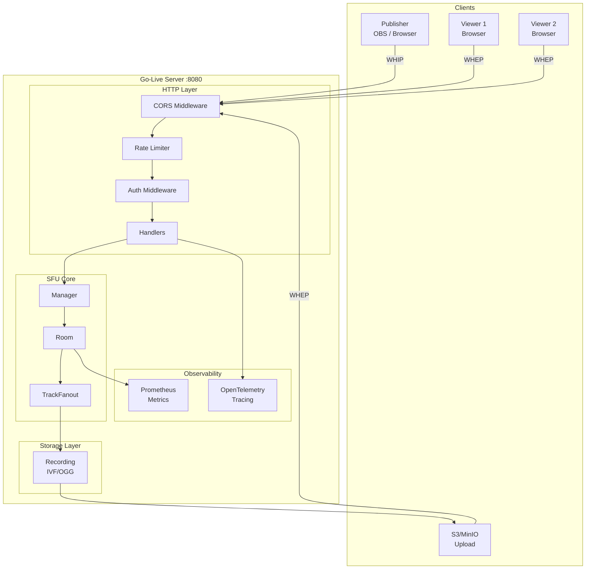
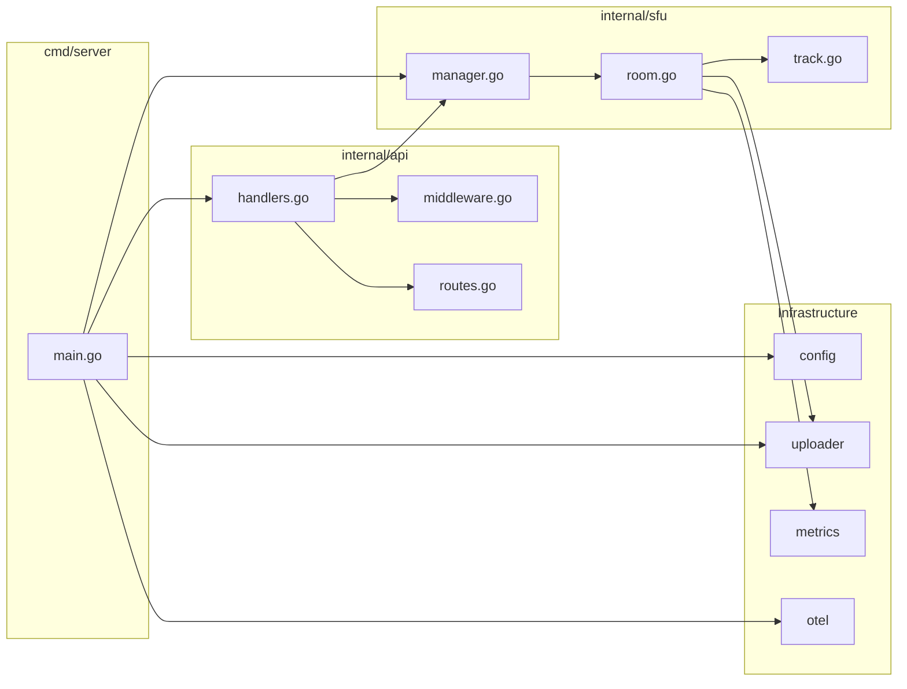
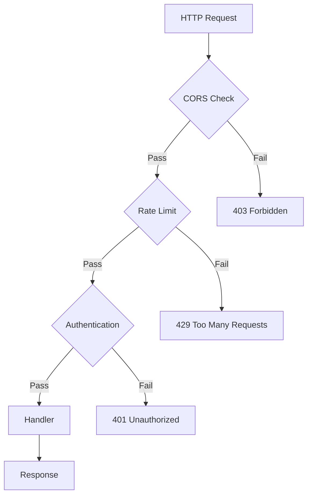

# System Architecture Overview

This document describes the overall architecture of Go-Live, a WebRTC SFU server built with Go and Pion WebRTC.

## Architecture Diagram

## Component Dependency Graph

## Request Processing Chain

## Core Concepts

### Room

The Room is the core abstraction of the SFU. Each room:
- Has at most one Publisher
- Can have multiple Subscribers
- Has independent Track Fanout logic
- Can have its own authentication token

### Track Fanout

When a publisher pushes media tracks, the system creates a Track Fanout:
- Read RTP packets from the publisher's PeerConnection
- Copy and distribute to all subscribers
- Optionally write to recording files

### PeerConnection

Each WebRTC connection:
- **Publisher**: Receives media tracks
- **Subscriber**: Sends media tracks
- ICE negotiation completed through WHIP/WHEP protocols

## Module Responsibilities

| Module | Responsibility |
|--------|----------------|
| `cmd/server` | Application entry point, service initialization |
| `internal/config` | Environment variable parsing and defaults |
| `internal/api` | HTTP request handling, routing, middleware |
| `internal/sfu` | WebRTC SFU core logic |
| `internal/metrics` | Prometheus metrics exposure |
| `internal/uploader` | S3/MinIO file upload |
| `internal/otel` | OpenTelemetry tracer initialization |

## Key Design Decisions

### 1. Single Publisher per Room

Simplifies the SFU logic and ensures predictable stream quality. Multiple publishers would require stream selection or mixing.

### 2. In-Memory Room State

Rooms are stored in memory for simplicity and performance. For multi-instance deployment, external storage (Redis/Database) would be needed.

### 3. RTP Forwarding without Transcoding

The SFU forwards RTP packets directly without decoding/encoding, minimizing latency and CPU usage.

### 4. Recording at SFU Level

Recording happens at the TrackFanout level, capturing the exact RTP packets being distributed to subscribers.

## Performance Characteristics

| Metric | Value |
|--------|-------|
| Latency | < 100ms (same region) |
| Concurrent Subscribers | 1000+ per room |
| Memory (idle) | < 50MB |
| CPU Efficiency | Single core handles 500+ concurrent |

## Next Steps

- [SFU Core](/en/architecture/sfu-core) - Detailed SFU implementation
- [Data Flow](/en/architecture/data-flow) - Request and data flow diagrams
- [Deployment](/en/architecture/deployment) - Deployment patterns and topology
