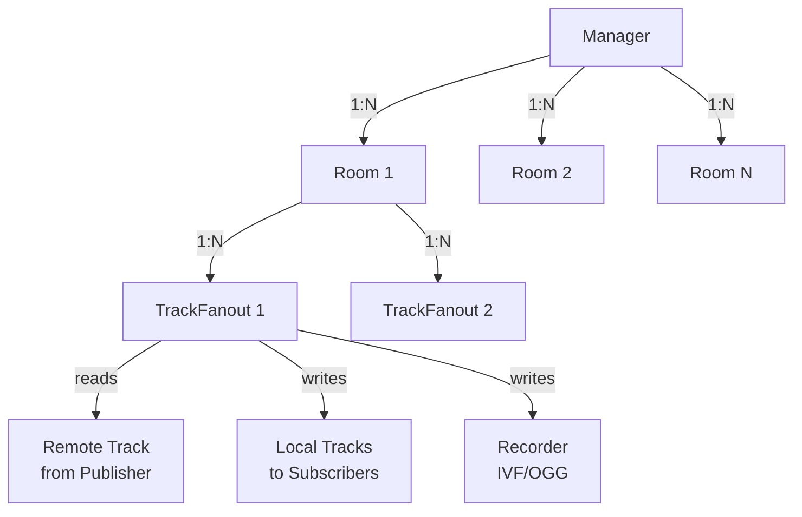
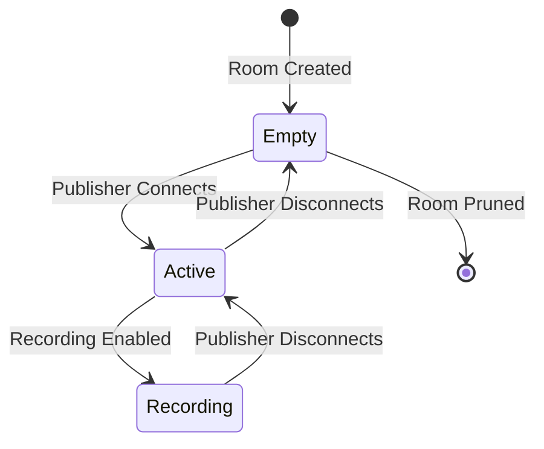
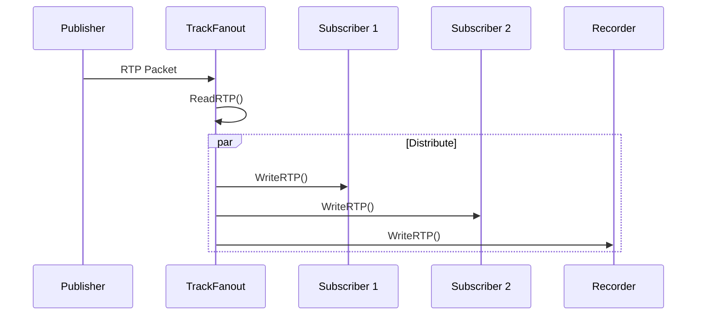
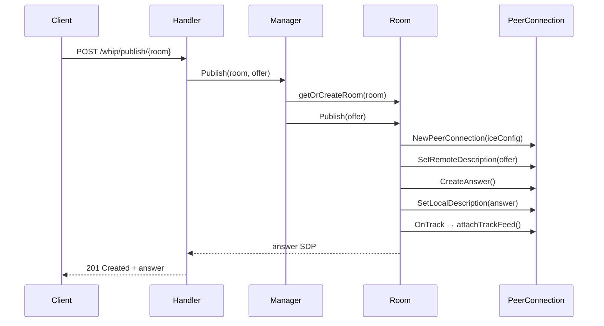
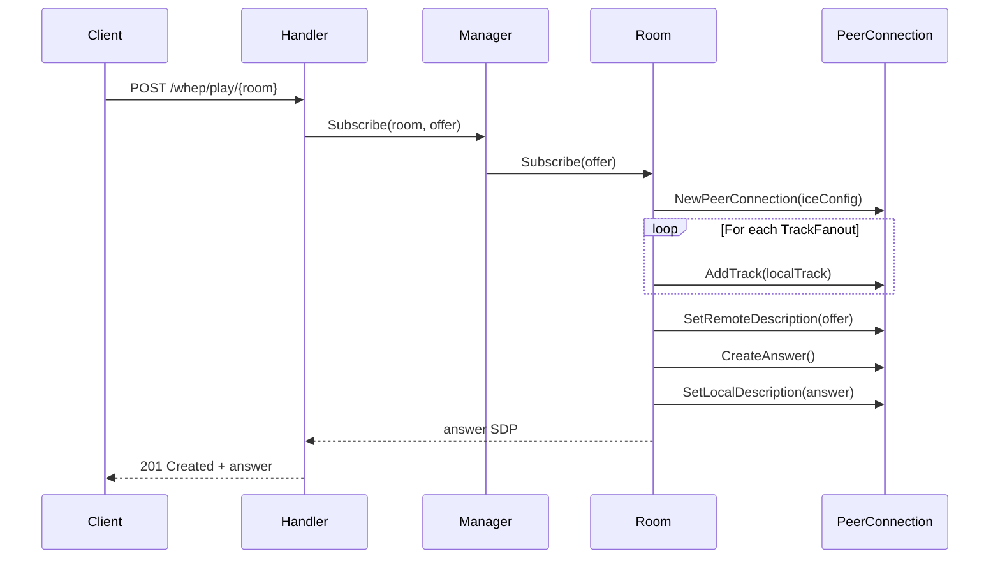
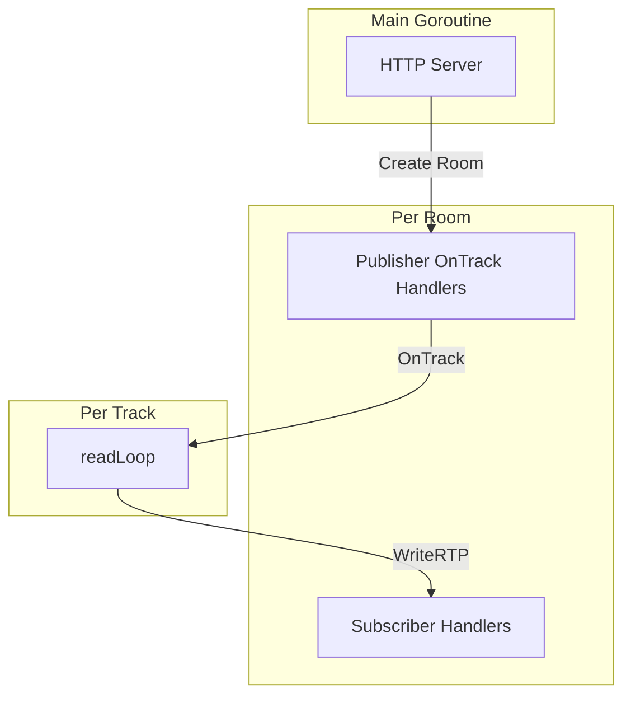

# SFU Core Implementation

Detailed documentation of the SFU (Selective Forwarding Unit) core logic.

## Component Hierarchy



## Manager

The Manager is the top-level component that manages all rooms.

```go
type Manager struct {
    rooms     map[string]*Room    // Room name → Room instance
    roomsMu   sync.RWMutex        // Protects rooms map
    iceConfig ICEConfig           // ICE server configuration
    config    Config              // Server configuration
}
```

### Key Methods

| Method | Purpose |
|--------|---------|
| `Publish(roomName, sdpOffer)` | Create room, establish publisher connection |
| `Subscribe(roomName, sdpOffer)` | Create subscriber connection, bind existing tracks |
| `CloseRoom(roomName)` | Force close a room |
| `ListRooms()` | Return all active rooms |
| `RoomCount()` | Return number of active rooms |

## Room

Each Room represents an isolated streaming session.

```go
type Room struct {
    name         string
    publisher    *webrtc.PeerConnection
    subscribers  map[string]*webrtc.PeerConnection
    trackFeeds   map[uint32]*TrackFanout  // SSRC → TrackFanout
    mu           sync.RWMutex
    config       Config
}
```

### Room Lifecycle



### Key Methods

| Method | Purpose |
|--------|---------|
| `Publish(sdpOffer)` | Establish publisher PeerConnection |
| `Subscribe(sdpOffer)` | Add subscriber, bind to existing tracks |
| `attachTrackFeed(track)` | Distribute new track to all subscribers |
| `closePublisher()` | Clean up publisher and all recordings |
| `removeSubscriber(id)` | Remove subscriber connection |
| `pruneIfEmpty()` | Delete room if no publisher/subscribers |

## TrackFanout

TrackFanout handles RTP packet distribution for a single media track.

```go
type TrackFanout struct {
    remoteTrack  *webrtc.TrackRemote
    localTracks  map[string]*webrtc.TrackLocalStaticRTP
    recorder     rtpWriter  // IVF or OGG writer
    stopChan     chan struct{}
}
```

### RTP Distribution Flow



### readLoop

The core loop that reads RTP packets and distributes them:

```go
func (tf *TrackFanout) readLoop() {
    for {
        rtp, err := tf.remoteTrack.ReadRTP()
        if err != nil {
            return
        }

        // Distribute to all subscribers
        for _, local := range tf.localTracks {
            local.WriteRTP(rtp)
        }

        // Write to recorder if enabled
        if tf.recorder != nil {
            tf.recorder.WriteRTP(rtp)
        }
    }
}
```

## PeerConnection Management

### Publisher Connection



### Subscriber Connection



## ICE Configuration

ICE servers are configured via environment variables:

```go
type ICEConfig struct {
    STUNURLs   []string
    TURNURLs   []string
    TURNUser   string
    TURNPass   string
}
```

Default STUN: `stun:stun.l.google.com:19302`

## Memory Layout

```
Manager
├── rooms map[string]*Room
│   ├── "room1" → Room
│   │   ├── publisher *PeerConnection
│   │   ├── subscribers map[string]*PeerConnection
│   │   │   ├── "sub1" → PeerConnection
│   │   │   └── "sub2" → PeerConnection
│   │   └── trackFeeds map[uint32]*TrackFanout
│   │       ├── 12345 → TrackFanout (video)
│   │       │   ├── remoteTrack
│   │       │   ├── localTracks map[string]*TrackLocalStaticRTP
│   │       │   └── recorder
│   │       └── 67890 → TrackFanout (audio)
│   └── "room2" → Room
└── iceConfig
```

## Concurrency Model

- **Manager.roomsMu**: Protects the rooms map
- **Room.mu**: Protects publisher, subscribers, trackFeeds
- **TrackFanout**: Single goroutine (readLoop) per track

### Goroutine Lifecycle



## Next Steps

- [Data Flow](/en/architecture/data-flow) - Complete request flow diagrams
- [WHIP Protocol](/en/protocols/whip) - WHIP publishing details
- [WHEP Protocol](/en/protocols/whep) - WHEP playback details
