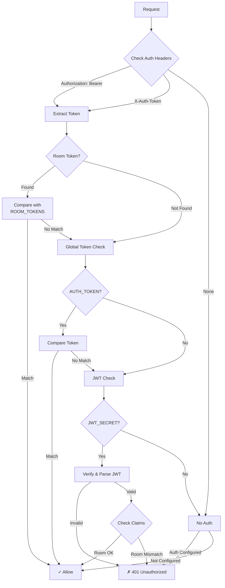
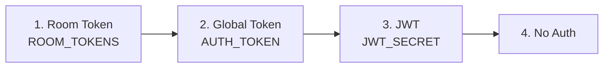

# Authentication

Multi-layer authentication system with token and JWT support.

## Authentication Flow



## Token Authentication

### Global Token

Single token for all rooms:

```bash
AUTH_TOKEN=my-secret-token
```

```http
Authorization: Bearer my-secret-token
# or
X-Auth-Token: my-secret-token
```

### Per-Room Tokens

Different tokens for different rooms:

```bash
ROOM_TOKENS=room1:token1;room2:token2;room3:token3
```

| Room | Token |
|------|-------|
| `room1` | `token1` |
| `room2` | `token2` |
| `room3` | `token3` |
| `room4` | Falls back to `AUTH_TOKEN` |

## JWT Authentication

JWT provides more flexibility with claims.

### JWT Structure

```json
{
  "sub": "user123",
  "room": "demo",
  "role": "admin",
  "admin": true,
  "exp": 1710123456,
  "iat": 1710120000
}
```

### JWT Claims

| Claim | Type | Description |
|-------|------|-------------|
| `sub` | string | Subject (user identifier) |
| `room` | string | Restrict to specific room (optional) |
| `role` | string | Role (`admin` for admin access) |
| `admin` | boolean | Admin flag (alternative to role) |
| `exp` | number | Expiration timestamp |
| `iat` | number | Issued at timestamp |

### JWT Configuration

```bash
JWT_SECRET=your-signing-secret
JWT_AUDIENCE=your-app-name  # Optional: require specific audience
```

### JWT Generation Example

```go
import (
    "github.com/golang-jwt/jwt/v5"
    "time"
)

type roomClaims struct {
    Room  string `json:"room,omitempty"`
    Role  string `json:"role,omitempty"`
    jwt.RegisteredClaims
}

func generateToken(secret, room string) (string, error) {
    claims := roomClaims{
        Room: room,
        Role: "user",
        RegisteredClaims: jwt.RegisteredClaims{
            ExpiresAt: jwt.NewNumericDate(time.Now().Add(24 * time.Hour)),
            IssuedAt:  jwt.NewNumericDate(time.Now()),
        },
    }
    
    token := jwt.NewWithClaims(jwt.SigningMethodHS256, claims)
    return token.SignedString([]byte(secret))
}
```

## Admin Authentication

Admin endpoints require `ADMIN_TOKEN`:

```bash
ADMIN_TOKEN=admin-secret-token
```

```http
POST /api/admin/rooms/{room}/close
Authorization: Bearer admin-secret-token
```

## Authentication Priority



## Security Best Practices

### Token Security

- Use strong, random tokens (32+ characters)
- Rotate tokens periodically
- Use different tokens for different environments
- Never commit tokens to version control

### JWT Security

- Use strong signing secret (256+ bits)
- Set appropriate expiration times
- Validate audience claim if using `JWT_AUDIENCE`
- Use HTTPS in production

### Example Token Generation

```bash
# Generate random token
openssl rand -hex 32

# Generate JWT secret
openssl rand -base64 32
```

## Authorization Header Formats

Two formats are supported:

```http
# Bearer token (recommended)
Authorization: Bearer <token>

# Custom header
X-Auth-Token: <token>
```

## Error Responses

| Status | Message | Cause |
|--------|---------|-------|
| 401 | `unauthorized` | Invalid/missing token |
| 403 | `forbidden` | JWT room mismatch |
