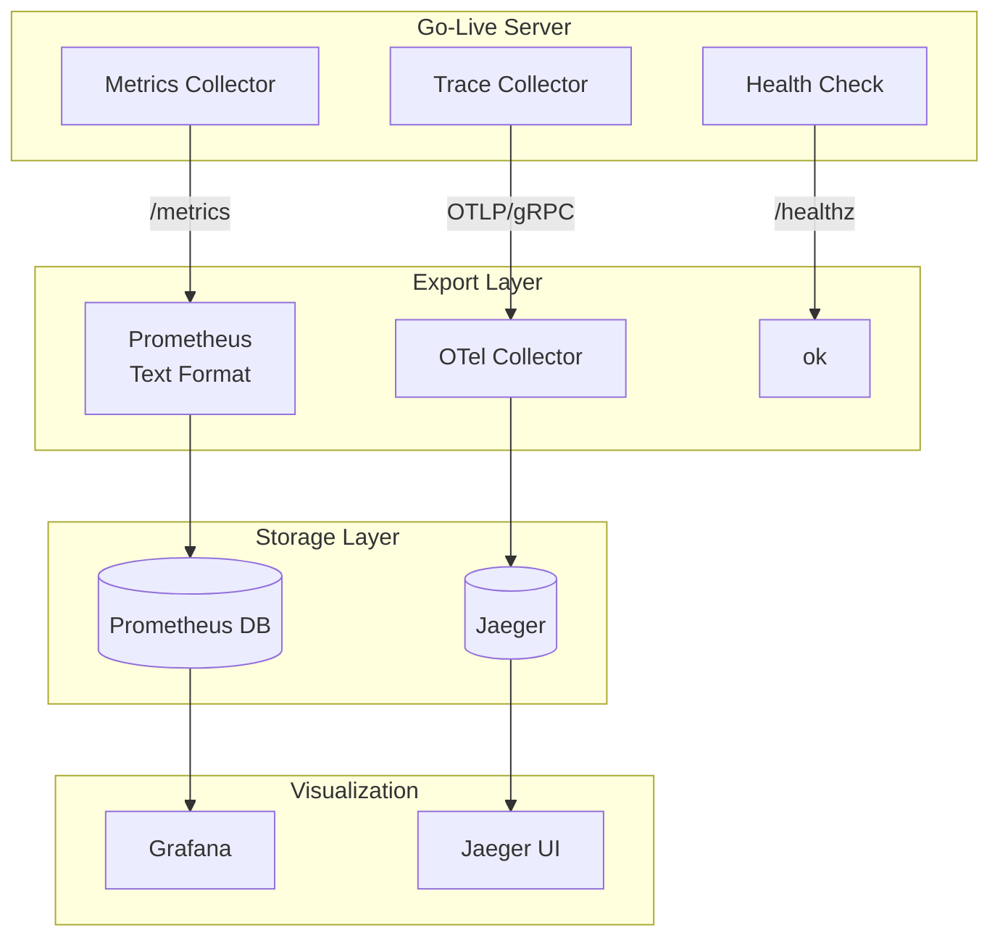

# Observability

Prometheus metrics, OpenTelemetry tracing, and health checks.

## Observability Architecture



## Prometheus Metrics

### Endpoint

```http
GET /metrics
```

### Available Metrics

| Metric | Type | Labels | Description |
|--------|------|--------|-------------|
| `live_rooms` | Gauge | - | Active room count |
| `live_subscribers` | GaugeVec | `room` | Subscribers per room |
| `live_rtp_bytes_total` | CounterVec | `room` | Total RTP bytes transmitted |
| `live_rtp_packets_total` | CounterVec | `room` | Total RTP packets transmitted |

### Example Output

```
# HELP live_rooms Active room count
# TYPE live_rooms gauge
live_rooms 3

# HELP live_subscribers Subscribers per room
# TYPE live_subscribers gauge
live_subscribers{room="demo"} 5
live_subscribers{room="test"} 2
live_subscribers{room="live"} 10

# HELP live_rtp_bytes_total Total RTP bytes
# TYPE live_rtp_bytes_total counter
live_rtp_bytes_total{room="demo"} 1.048576e+08

# HELP live_rtp_packets_total Total RTP packets
# TYPE live_rtp_packets_total counter
live_rtp_packets_total{room="demo"} 1.0e+06
```

### Prometheus Scrape Configuration

```yaml
scrape_configs:
  - job_name: 'live-webrtc'
    scrape_interval: 10s
    static_configs:
      - targets: ['live-webrtc:8080']
```

### Grafana Dashboard

Key panels to create:

| Panel | Query | Visualization |
|-------|-------|---------------|
| Active Rooms | `live_rooms` | Stat |
| Total Subscribers | `sum(live_subscribers)` | Stat |
| RTP Throughput | `rate(live_rtp_bytes_total[1m])` | Graph |
| Packets/sec | `rate(live_rtp_packets_total[1m])` | Graph |

## OpenTelemetry Tracing

### Configuration

```bash
OTEL_EXPORTER_OTLP_ENDPOINT=otel-collector:4317
OTEL_EXPORTER_OTLP_PROTOCOL=grpc
OTEL_SERVICE_NAME=live-webrtc-go
```

### Traced Operations

| Span Name | Attributes |
|-----------|------------|
| `HTTP {method} {path}` | `http.method`, `http.status_code`, `http.route` |
| `whip.publish` | `room`, `sdp.size` |
| `whep.play` | `room`, `sdp.size` |
| `room.create` | `room` |
| `room.close` | `room` |

### OTel Collector Configuration

```yaml
receivers:
  otlp:
    protocols:
      grpc:
        endpoint: 0.0.0.0:4317

exporters:
  jaeger:
    endpoint: jaeger:14250
    tls:
      insecure: true

service:
  pipelines:
    traces:
      receivers: [otlp]
      exporters: [jaeger]
```

## Health Check

### Endpoint

```http
GET /healthz
```

Response:
```
ok
```

Status: 200 OK

### Kubernetes Probe

```yaml
livenessProbe:
  httpGet:
    path: /healthz
    port: 8080
  initialDelaySeconds: 5
  periodSeconds: 10

readinessProbe:
  httpGet:
    path: /healthz
    port: 8080
  initialDelaySeconds: 5
  periodSeconds: 10
```

## Debug Endpoints

### pprof

Enable with `PPROF=1`:

```bash
PPROF=1 go run ./cmd/server
```

Access:
- `/debug/pprof/` - Index page
- `/debug/pprof/heap` - Heap profile
- `/debug/pprof/goroutine` - Goroutine profile
- `/debug/pprof/profile` - CPU profile

### CPU Profiling

```bash
# Capture 30s CPU profile
curl -o cpu.prof "http://localhost:8080/debug/pprof/profile?seconds=30"

# Analyze
go tool pprof cpu.prof
```

### Heap Profiling

```bash
# Capture heap profile
curl -o heap.prof "http://localhost:8080/debug/pprof/heap"

# Analyze
go tool pprof heap.prof
```

## Monitoring Best Practices

### Alerts

| Alert | Condition | Severity |
|-------|-----------|----------|
| HighMemory | `go_memstats_heap_alloc_bytes > 1GB` | Warning |
| HighCPU | `rate(process_cpu_seconds_total[1m]) > 0.8` | Warning |
| NoRooms | `live_rooms == 0` for 5m | Info |
| HighSubscribers | `live_subscribers > 500` | Warning |

### Example Alertmanager Rules

```yaml
groups:
  - name: live-webrtc
    rules:
      - alert: HighMemory
        expr: go_memstats_heap_alloc_bytes > 1073741824
        for: 5m
        labels:
          severity: warning
        annotations:
          summary: "High memory usage"
          
      - alert: HighSubscriberCount
        expr: live_subscribers > 500
        for: 1m
        labels:
          severity: warning
        annotations:
          summary: "High subscriber count in {{ $labels.room }}"
```

## Troubleshooting Commands

```bash
# Check metrics
curl http://localhost:8080/metrics | grep live_

# Health check
curl http://localhost:8080/healthz

# View goroutines
curl http://localhost:8080/debug/pprof/goroutine?debug=1

# Memory stats
curl http://localhost:8080/debug/pprof/heap?debug=1 | head -20
```
