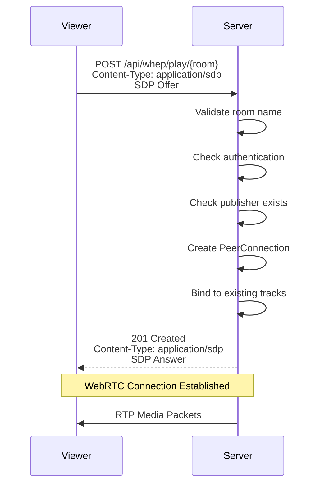
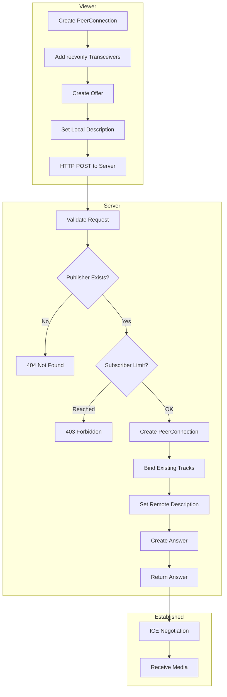

# WHEP Protocol

WHEP (WebRTC-HTTP Egress Protocol) is used for subscribing to media streams.

## Overview



## Endpoint

```http
POST /api/whep/play/{room}
Content-Type: application/sdp
Authorization: Bearer <token>
```

### Parameters

| Parameter | Location | Type | Description |
|-----------|----------|------|-------------|
| `room` | path | string | Room name (1-64 chars, `A-Za-z0-9_-`) |

### Request Body

SDP Offer with recvonly transceivers

```sdp
v=0
o=- 123456789 2 IN IP4 127.0.0.1
s=-
t=0 0
m=video 9 UDP/TLS/RTP/SAVPF 96
a=rtpmap:96 VP8/90000
a=recvonly
...
```

### Response Codes

| Code | Description |
|------|-------------|
| 201 | Success - SDP Answer returned |
| 400 | Invalid room name or SDP |
| 401 | Authentication failed |
| 403 | Subscriber limit reached |
| 404 | No active publisher in room |
| 429 | Rate limit exceeded |

## Connection Flow



## Browser Example

```javascript
// Get ICE configuration
const config = await fetch('/api/bootstrap').then(r => r.json());

// Create PeerConnection
const pc = new RTCPeerConnection({
  iceServers: config.iceServers
});

// Create recvonly transceivers
pc.addTransceiver('video', { direction: 'recvonly' });
pc.addTransceiver('audio', { direction: 'recvonly' });

// Handle incoming tracks
const video = document.getElementById('video');
pc.ontrack = (event) => {
  video.srcObject = event.streams[0];
};

// Create offer
const offer = await pc.createOffer();
await pc.setLocalDescription(offer);

// Wait for ICE gathering
await new Promise(resolve => {
  if (pc.iceGatheringState === 'complete') {
    resolve();
  } else {
    pc.onicegatheringstatechange = () => {
      if (pc.iceGatheringState === 'complete') resolve();
    };
  }
});

// Send WHEP request
const response = await fetch('/api/whep/play/myroom', {
  method: 'POST',
  headers: {
    'Content-Type': 'application/sdp',
    'Authorization': 'Bearer mytoken'
  },
  body: pc.localDescription.sdp
});

if (response.ok) {
  const answer = await response.text();
  await pc.setRemoteDescription({ type: 'answer', sdp: answer });
}
```

## Track Binding

When a subscriber connects, existing tracks are bound:

```mermaid
flowchart TB
    subgraph Subscriber
        S[New Subscriber]
    end

    subgraph Room
        S --> R[Room]
        R --> TF1[TrackFanout 1<br/>Video]
        R --> TF2[TrackFanout 2<br/>Audio]
        
        TF1 --> L1[Create Local Track]
        TF2 --> L2[Create Local Track]
        
        L1 --> PC[Subscriber<br/>PeerConnection]
        L2 --> PC
    end

    Note over PC: RTP packets flow from<br/>TrackFanout to Subscriber
```

## Error Handling

| Error | Cause | Solution |
|-------|-------|----------|
| `404 Not Found` | No publisher in room | Wait for publisher |
| `403 Forbidden` | Subscriber limit reached | Increase `MAX_SUBS_PER_ROOM` |
| `401 Unauthorized` | Invalid/missing token | Check authentication |

## Cleanup on Disconnect

When a subscriber disconnects:
1. Local track bindings are removed from TrackFanouts
2. PeerConnection is closed
3. Room is pruned if empty
