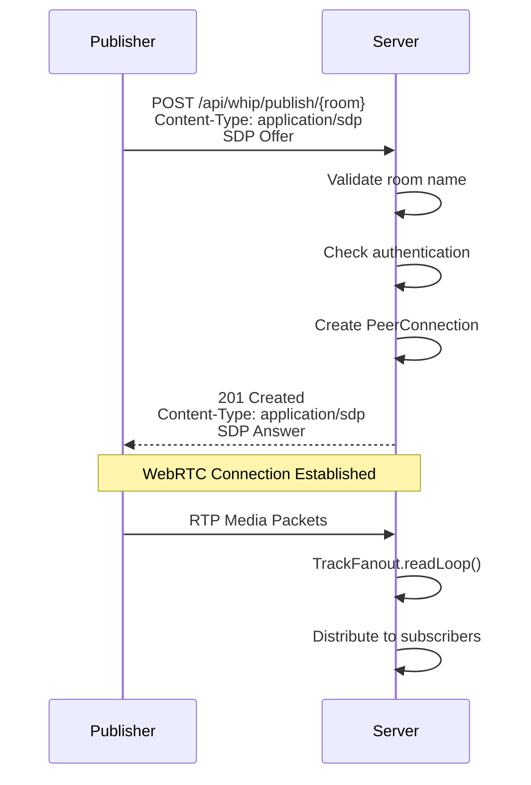
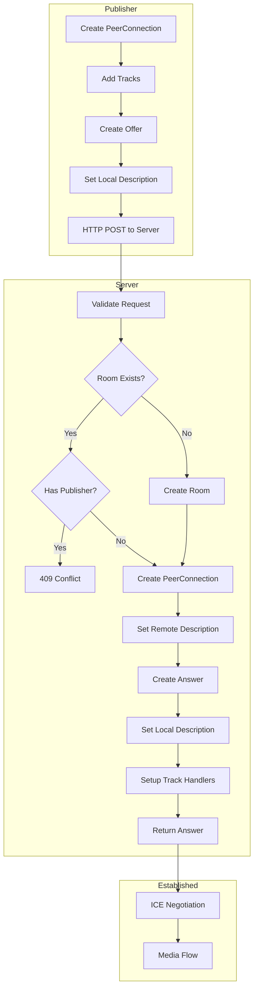

# WHIP Protocol

WHIP (WebRTC-HTTP Ingestion Protocol) is used for publishing media streams.

## Overview



## Endpoint

```http
POST /api/whip/publish/{room}
Content-Type: application/sdp
Authorization: Bearer <token>
```

### Parameters

| Parameter | Location | Type | Description |
|-----------|----------|------|-------------|
| `room` | path | string | Room name (1-64 chars, `A-Za-z0-9_-`) |

### Request Body

SDP Offer (Session Description Protocol)

```sdp
v=0
o=- 123456789 2 IN IP4 127.0.0.1
s=-
t=0 0
a=group:BUNDLE 0 1
m=video 9 UDP/TLS/RTP/SAVPF 96
a=rtpmap:96 VP8/90000
a=sendonly
...
```

### Response Codes

| Code | Description |
|------|-------------|
| 201 | Success - SDP Answer returned |
| 400 | Invalid room name or SDP |
| 401 | Authentication failed |
| 409 | Room already has a publisher |
| 429 | Rate limit exceeded |

## Connection Flow



## OBS Configuration

1. Open OBS Studio
2. Go to Settings → Stream
3. Service: Select "WHIP"
4. Server: `http://your-server:8080/api/whip/publish/{room}`
5. Bearer Token: Your authentication token
6. Click "Start Streaming"

## Browser Example

```javascript
const pc = new RTCPeerConnection({
  iceServers: [{ urls: 'stun:stun.l.google.com:19302' }]
});

// Get user media
const stream = await navigator.mediaDevices.getUserMedia({
  video: true,
  audio: true
});

// Add tracks to connection
stream.getTracks().forEach(track => {
  pc.addTrack(track, stream);
});

// Create offer
const offer = await pc.createOffer();
await pc.setLocalDescription(offer);

// Wait for ICE gathering
await new Promise(resolve => {
  if (pc.iceGatheringState === 'complete') {
    resolve();
  } else {
    pc.onicegatheringstatechange = () => {
      if (pc.iceGatheringState === 'complete') resolve();
    };
  }
});

// Send WHIP request
const response = await fetch('/api/whip/publish/myroom', {
  method: 'POST',
  headers: {
    'Content-Type': 'application/sdp',
    'Authorization': 'Bearer mytoken'
  },
  body: pc.localDescription.sdp
});

if (response.ok) {
  const answer = await response.text();
  await pc.setRemoteDescription({ type: 'answer', sdp: answer });
}
```

## Error Handling

| Error | Cause | Solution |
|-------|-------|----------|
| `409 Conflict` | Room already has publisher | Use different room name |
| `401 Unauthorized` | Invalid/missing token | Check authentication |
| `400 Bad Request` | Invalid room name | Use `^[A-Za-z0-9_-]{1,64}$` |

## Cleanup on Disconnect

When the publisher disconnects:
1. All TrackFanouts are closed
2. Recording files are finalized and uploaded
3. All subscriber connections are closed
4. Room is pruned if empty
