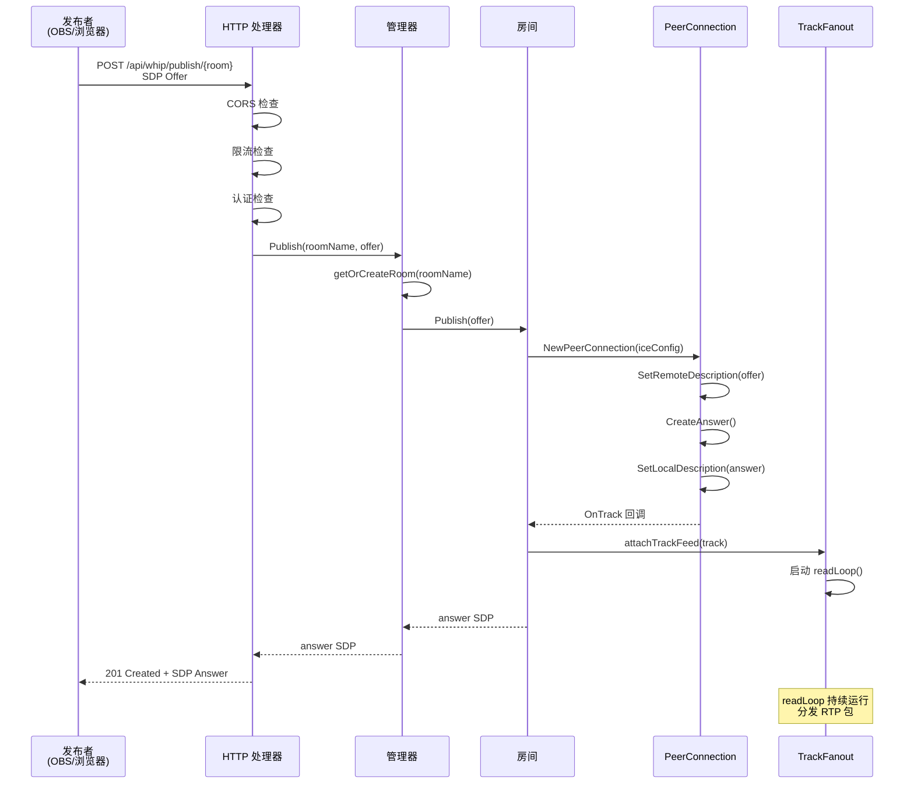
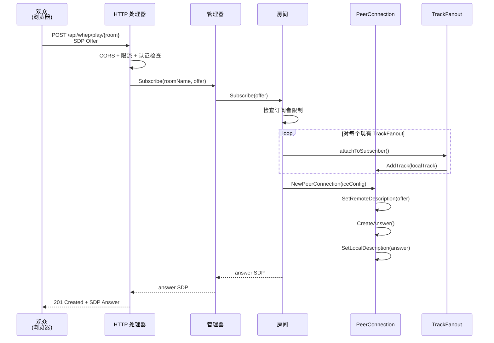
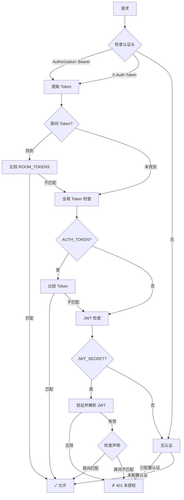
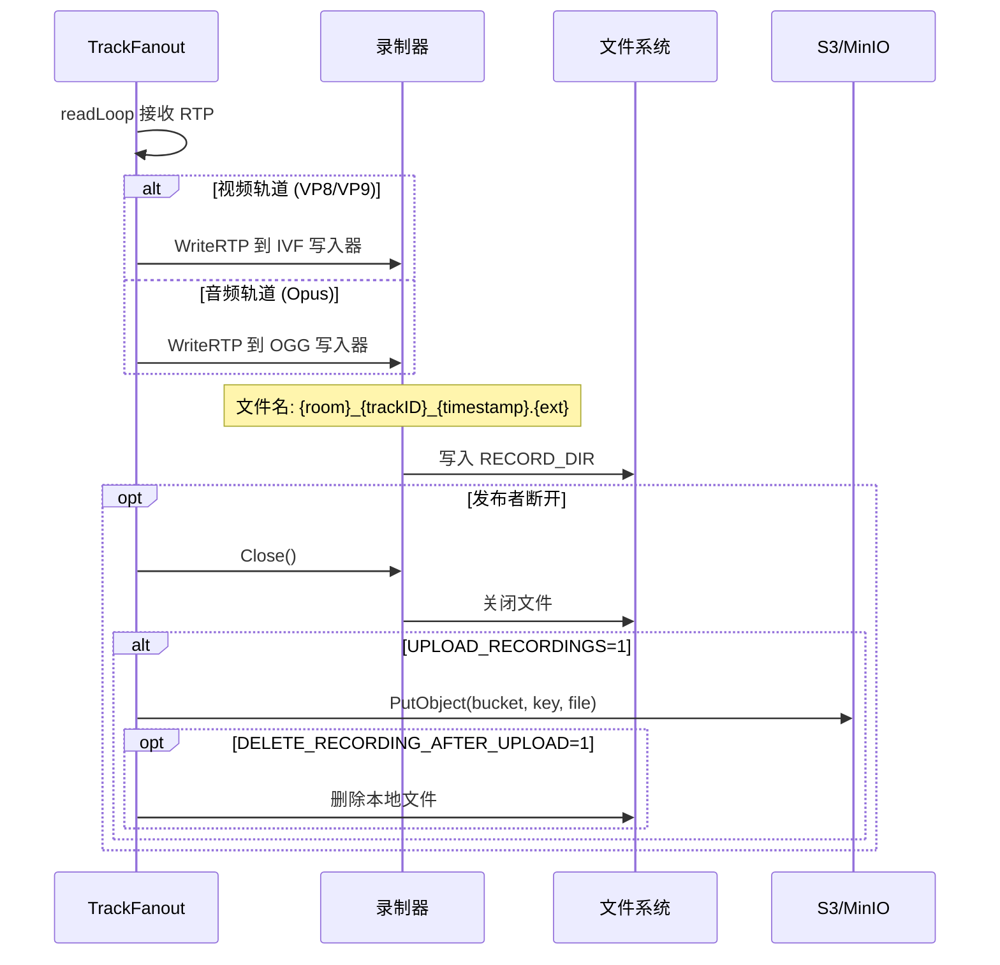

# 数据流

请求和数据流的详细文档。

## WHIP 发布流程

```mermaid
sequenceDiagram
    participant P as 发布者<br/>(OBS/浏览器)
    participant H as HTTP 处理器
    participant M as 管理器
    participant R as 房间
    participant PC as PeerConnection
    participant TF as TrackFanout

    P->>H: POST /api/whip/publish/{room}<br/>SDP Offer
    H->>H: CORS 检查
    H->>H: 限流检查
    H->>H: 认证检查
    
    H->>M: Publish(roomName, offer)
    M->>M: getOrCreateRoom(roomName)
    M->>R: Publish(offer)
    
    R->>PC: NewPeerConnection(iceConfig)
    PC->>PC: SetRemoteDescription(offer)
    PC->>PC: CreateAnswer()
    PC->>PC: SetLocalDescription(answer)
    
    PC-->>R: OnTrack 回调
    R->>TF: attachTrackFeed(track)
    TF->>TF: 启动 readLoop()
    
    R-->>M: answer SDP
    M-->>H: answer SDP
    H-->>P: 201 Created + SDP Answer
    
    Note over TF: readLoop 持续运行<br/>分发 RTP 包
```

## WHEP 播放流程

```mermaid
sequenceDiagram
    participant V as 观众<br/>(浏览器)
    participant H as HTTP 处理器
    participant M as 管理器
    participant R as 房间
    participant PC as PeerConnection
    participant TF as TrackFanout

    V->>H: POST /api/whep/play/{room}<br/>SDP Offer
    H->>H: CORS + 限流 + 认证检查
    
    H->>M: Subscribe(roomName, offer)
    M->>R: Subscribe(offer)
    
    R->>R: 检查订阅者限制
    
    loop 对每个现有 TrackFanout
        R->>TF: attachToSubscriber()
        TF->>PC: AddTrack(localTrack)
    end
    
    R->>PC: NewPeerConnection(iceConfig)
    PC->>PC: SetRemoteDescription(offer)
    PC->>PC: CreateAnswer()
    PC->>PC: SetLocalDescription(answer)
    
    R-->>M: answer SDP
    M-->>H: answer SDP
    H-->>V: 201 Created + SDP Answer
```

## 认证流程

```mermaid
flowchart TB
    REQ[请求] --> HEADER{检查认证头}
    
    HEADER -->|Authorization: Bearer| TOKEN[提取 Token]
    HEADER -->|X-Auth-Token| TOKEN
    HEADER -->|无| NOAUTH[无认证]
    
    TOKEN --> ROOM{房间 Token?}
    ROOM -->|找到| ROOMCHECK[比较 ROOM_TOKENS]
    ROOM -->|未找到| GLOBAL
    
    ROOMCHECK -->|匹配| ALLOW[✓ 允许]
    ROOMCHECK -->|不匹配| GLOBAL
    
    GLOBAL[全局 Token 检查] --> GLOBALFOUND{AUTH_TOKEN?}
    GLOBALFOUND -->|是| GLOBALCHECK[比较 Token]
    GLOBALFOUND -->|否| JWT
    
    GLOBALCHECK -->|匹配| ALLOW
    GLOBALCHECK -->|不匹配| JWT
    
    JWT[JWT 检查] --> JWTFOUND{JWT_SECRET?}
    JWTFOUND -->|是| JWTCHECK[验证并解析 JWT]
    JWTFOUND -->|否| NOAUTH
    
    JWTCHECK -->|无效| DENY[✗ 401 未授权]
    JWTCHECK -->|有效| JWTAUTH{检查声明}
    
    JWTAUTH -->|房间匹配| ALLOW
    JWTAUTH -->|房间不匹配| DENY
    
    NOAUTH -->|已配置认证| DENY
    NOAUTH -->|未配置认证| ALLOW
```

## 录制流程

```mermaid
sequenceDiagram
    participant TF as TrackFanout
    participant R as 录制器
    participant FS as 文件系统
    participant S3 as S3/MinIO

    TF->>TF: readLoop 接收 RTP
    
    alt 视频轨道 (VP8/VP9)
        TF->>R: WriteRTP 到 IVF 写入器
    else 音频轨道 (Opus)
        TF->>R: WriteRTP 到 OGG 写入器
    end
    
    Note over R: 文件名: {room}_{trackID}_{timestamp}.{ext}
    
    R->>FS: 写入 RECORD_DIR
    
    opt 发布者断开
        TF->>R: Close()
        R->>FS: 关闭文件
        
        alt UPLOAD_RECORDINGS=1
            TF->>S3: PutObject(bucket, key, file)
            
            opt DELETE_RECORDING_AFTER_UPLOAD=1
                TF->>FS: 删除本地文件
            end
        end
    end
```
