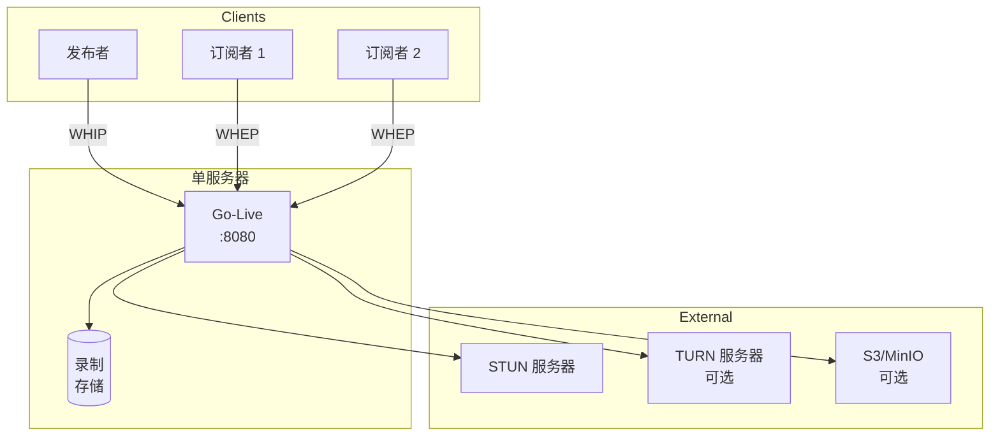
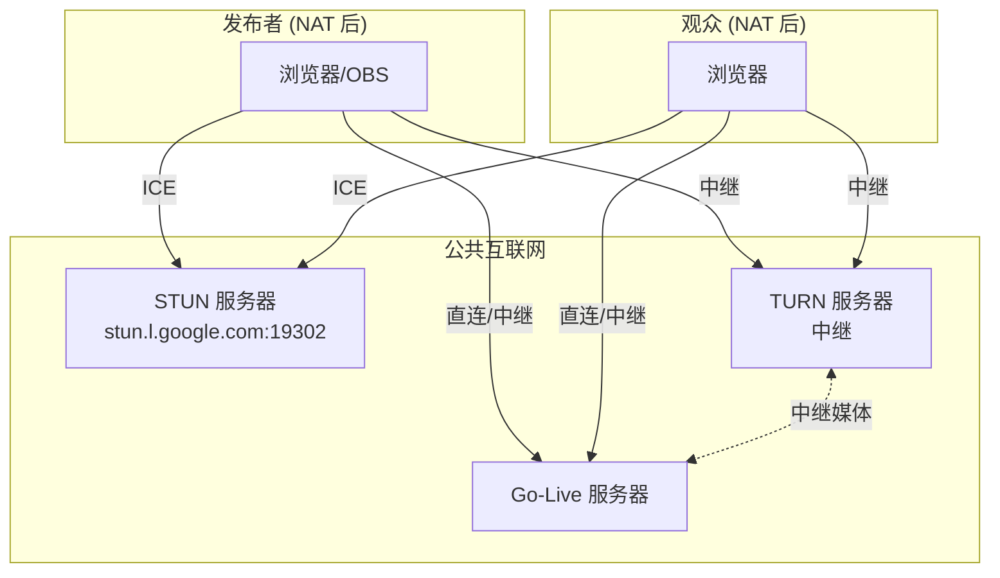
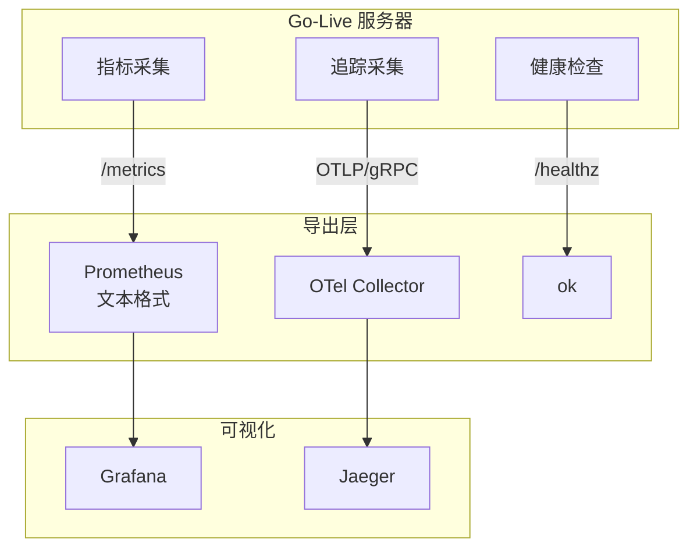

# 部署架构

Go-Live 的部署模式和拓扑选项。

## 单实例部署

最简单的部署模式，适合开发和小规模生产环境。



### Docker Compose

```yaml
version: '3.8'

services:
  live-webrtc:
    image: live-webrtc:latest
    ports:
      - "8080:8080"
    environment:
      - HTTP_ADDR=:8080
      - AUTH_TOKEN=${AUTH_TOKEN}
      - RECORD_ENABLED=1
      - RECORD_DIR=/records
    volumes:
      - ./records:/records
    restart: unless-stopped
```

## 多实例部署

用于高可用和水平扩展。

::: warning
多实例部署需要会话亲和性（粘性会话），因为房间状态在内存中。房间的所有客户端必须连接到同一实例。
:::

### Kubernetes 部署

```yaml
apiVersion: apps/v1
kind: Deployment
metadata:
  name: live-webrtc
spec:
  replicas: 3
  selector:
    matchLabels:
      app: live-webrtc
  template:
    metadata:
      labels:
        app: live-webrtc
    spec:
      containers:
      - name: live-webrtc
        image: live-webrtc:latest
        ports:
        - containerPort: 8080
        env:
        - name: HTTP_ADDR
          value: ":8080"
        - name: AUTH_TOKEN
          valueFrom:
            secretKeyRef:
              name: live-webrtc-secret
              key: auth-token
---
apiVersion: v1
kind: Service
metadata:
  name: live-webrtc
spec:
  selector:
    app: live-webrtc
  ports:
  - port: 80
    targetPort: 8080
  type: LoadBalancer
  # 多实例需要会话亲和性
  sessionAffinity: ClientIP
  sessionAffinityConfig:
    clientIP:
      timeoutSeconds: 3600
```

## NAT 穿透

对于 NAT 后的客户端，需要 TURN 服务器。



### TURN 配置

```bash
# 自托管 TURN (coturn)
TURN_URLS=turn:turn.example.com:3478,turns:turn.example.com:5349
TURN_USERNAME=username
TURN_PASSWORD=password
```

## 可观测性架构



### Prometheus 抓取配置

```yaml
scrape_configs:
  - job_name: 'live-webrtc'
    scrape_interval: 10s
    static_configs:
      - targets: ['live-webrtc:8080']
```

## 高可用考虑

| 组件 | 单实例 | 多实例 |
|------|--------|--------|
| 房间状态 | 内存 | 需要 Redis 同步 |
| 录制 | 本地文件系统 | S3/MinIO |
| 负载均衡 | 不适用 | 需要粘性会话 |
| 故障转移 | 手动重启 | 自动（丢失会话） |

::: tip
对于生产多实例部署，考虑通过 Redis 实现房间状态同步，或使用信令层将客户端重定向到正确实例。
:::
