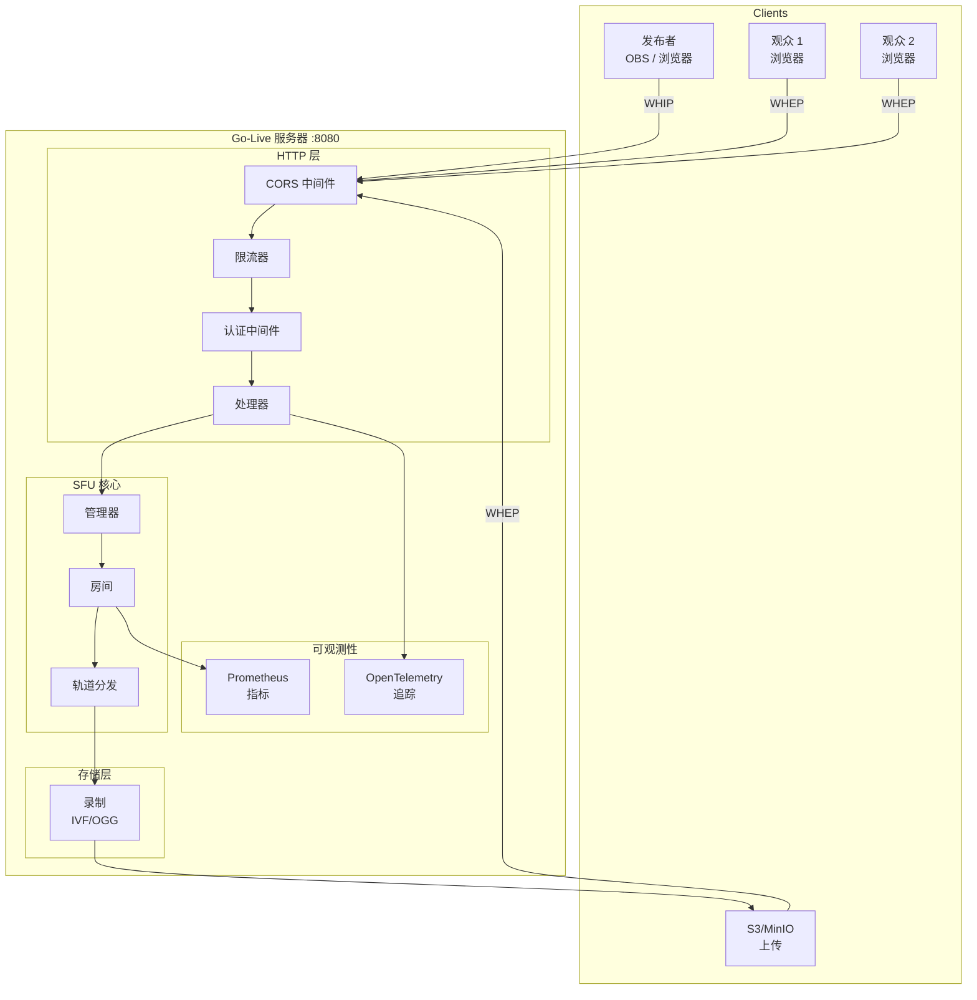
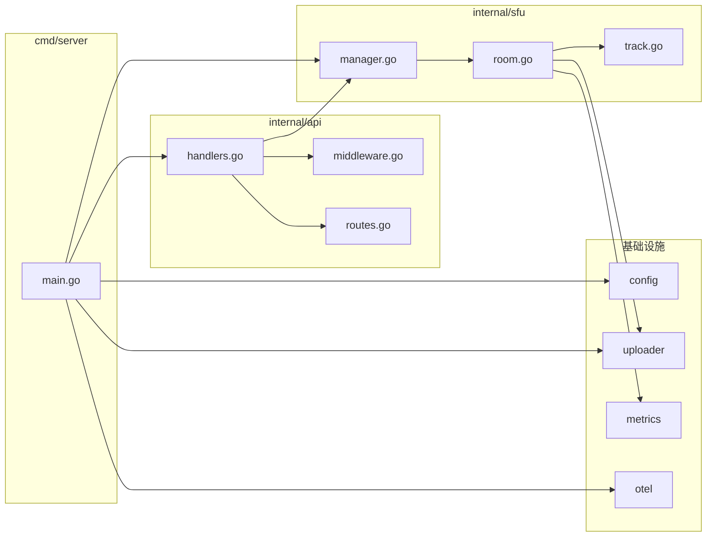

# 系统架构总览

本文档描述 Go-Live 的整体架构，一个基于 Go 和 Pion WebRTC 构建的 WebRTC SFU 服务器。

## 架构图

## 组件依赖图

## 核心概念

### 房间 (Room)

房间是 SFU 的核心抽象。每个房间：
- 最多有一个发布者
- 可以有多个订阅者
- 有独立的轨道分发逻辑
- 可以有自己的认证令牌

### 轨道分发 (Track Fanout)

当发布者推送媒体轨道时，系统创建轨道分发：
- 从发布者的 PeerConnection 读取 RTP 包
- 复制并分发给所有订阅者
- 可选写入录制文件

### PeerConnection

每个 WebRTC 连接：
- **发布者**：接收媒体轨道
- **订阅者**：发送媒体轨道
- 通过 WHIP/WHEP 协议完成 ICE 协商

## 模块职责

| 模块 | 职责 |
|------|------|
| `cmd/server` | 应用入口，服务初始化 |
| `internal/config` | 环境变量解析和默认值 |
| `internal/api` | HTTP 请求处理、路由、中间件 |
| `internal/sfu` | WebRTC SFU 核心逻辑 |
| `internal/metrics` | Prometheus 指标暴露 |
| `internal/uploader` | S3/MinIO 文件上传 |
| `internal/otel` | OpenTelemetry 追踪初始化 |

## 关键设计决策

### 1. 每房间单发布者

简化 SFU 逻辑，确保可预测的流质量。多发布者需要流选择或混合。

### 2. 内存房间状态

房间存储在内存中，简单且高性能。多实例部署需要外部存储（Redis/数据库）。

### 3. RTP 直接转发

SFU 直接转发 RTP 包，不解码/编码，最小化延迟和 CPU 使用。

### 4. SFU 级录制

录制发生在 TrackFanout 级别，捕获正在分发给订阅者的确切 RTP 包。

## 性能特征

| 指标 | 数值 |
|------|------|
| 延迟 | < 100ms（同区域） |
| 并发订阅者 | 1000+ / 房间 |
| 内存（空载） | < 50MB |
| CPU 效率 | 单核支持 500+ 并发 |

## 下一步

- [SFU 核心](/zh/architecture/sfu-core) - SFU 实现详解
- [数据流](/zh/architecture/data-flow) - 请求和数据流图
- [部署方案](/zh/architecture/deployment) - 部署模式和拓扑
