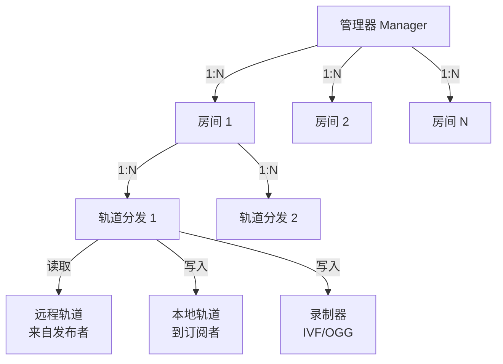
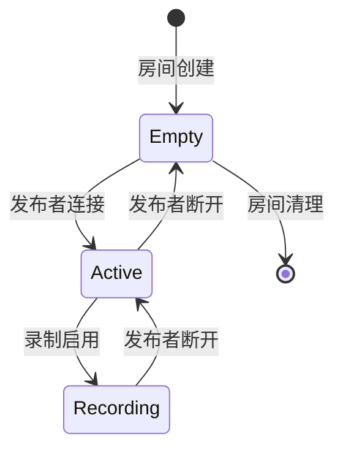
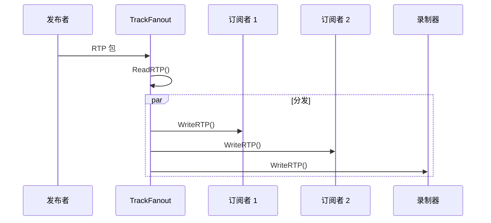
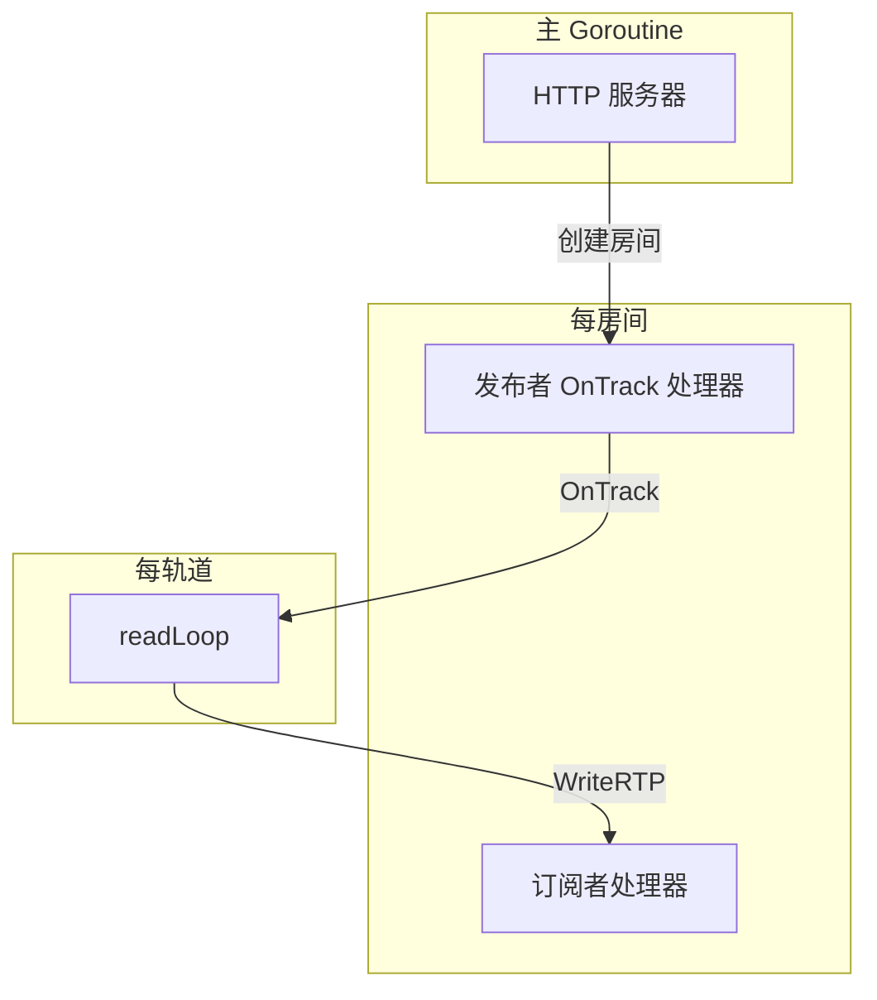

# SFU 核心实现

SFU（选择性转发单元）核心逻辑的详细文档。

## 组件层级



## 管理器 (Manager)

管理器是管理所有房间的顶层组件。

```go
type Manager struct {
    rooms     map[string]*Room    // 房间名 → 房间实例
    roomsMu   sync.RWMutex        // 保护 rooms map
    iceConfig ICEConfig           // ICE 服务器配置
    config    Config              // 服务器配置
}
```

### 关键方法

| 方法 | 用途 |
|------|------|
| `Publish(roomName, sdpOffer)` | 创建房间，建立发布者连接 |
| `Subscribe(roomName, sdpOffer)` | 创建订阅者连接，绑定现有轨道 |
| `CloseRoom(roomName)` | 强制关闭房间 |
| `ListRooms()` | 返回所有活跃房间 |
| `RoomCount()` | 返回活跃房间数量 |

## 房间 (Room)

每个房间代表一个独立的流媒体会话。

```go
type Room struct {
    name         string
    publisher    *webrtc.PeerConnection
    subscribers  map[string]*webrtc.PeerConnection
    trackFeeds   map[uint32]*TrackFanout  // SSRC → TrackFanout
    mu           sync.RWMutex
    config       Config
}
```

### 房间生命周期



## 轨道分发 (TrackFanout)

TrackFanout 处理单个媒体轨道的 RTP 包分发。

```go
type TrackFanout struct {
    remoteTrack  *webrtc.TrackRemote
    localTracks  map[string]*webrtc.TrackLocalStaticRTP
    recorder     rtpWriter  // IVF 或 OGG 写入器
    stopChan     chan struct{}
}
```

### RTP 分发流程



## 并发模型

- **Manager.roomsMu**：保护 rooms map
- **Room.mu**：保护 publisher、subscribers、trackFeeds
- **TrackFanout**：每个轨道单个 goroutine (readLoop)

### Goroutine 生命周期



## 下一步

- [数据流](/zh/architecture/data-flow) - 完整请求流程图
- [WHIP 协议](/zh/protocols/whip) - WHIP 发布详情
- [WHEP 协议](/zh/protocols/whep) - WHEP 播放详情
