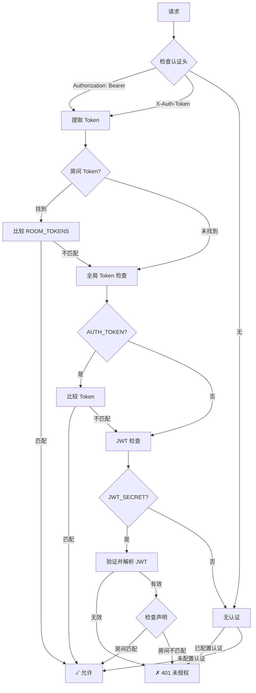
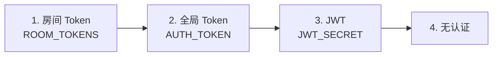

# 认证系统

多层认证系统，支持 Token 和 JWT。

## 认证流程



## Token 认证

### 全局 Token

所有房间使用同一 Token：

```bash
AUTH_TOKEN=my-secret-token
```

```http
Authorization: Bearer my-secret-token
# 或
X-Auth-Token: my-secret-token
```

### 房间级 Token

不同房间使用不同 Token：

```bash
ROOM_TOKENS=room1:token1;room2:token2;room3:token3
```

| 房间 | Token |
|------|-------|
| `room1` | `token1` |
| `room2` | `token2` |
| `room3` | `token3` |
| `room4` | 回退到 `AUTH_TOKEN` |

## JWT 认证

JWT 通过声明提供更多灵活性。

### JWT 结构

```json
{
  "sub": "user123",
  "room": "demo",
  "role": "admin",
  "admin": true,
  "exp": 1710123456,
  "iat": 1710120000
}
```

### JWT 声明

| 声明 | 类型 | 说明 |
|------|------|------|
| `sub` | string | 主题（用户标识符） |
| `room` | string | 限制到特定房间（可选） |
| `role` | string | 角色（`admin` 用于管理员访问） |
| `admin` | boolean | 管理员标志（role 的替代） |
| `exp` | number | 过期时间戳 |
| `iat` | number | 签发时间戳 |

### JWT 配置

```bash
JWT_SECRET=your-signing-secret
JWT_AUDIENCE=your-app-name  # 可选：要求特定 audience
```

## 管理员认证

管理员端点需要 `ADMIN_TOKEN`：

```bash
ADMIN_TOKEN=admin-secret-token
```

```http
POST /api/admin/rooms/{room}/close
Authorization: Bearer admin-secret-token
```

## 认证优先级



## 安全最佳实践

### Token 安全

- 使用强随机 Token（32+ 字符）
- 定期轮换 Token
- 不同环境使用不同 Token
- 永远不要将 Token 提交到版本控制

### JWT 安全

- 使用强签名密钥（256+ 位）
- 设置适当的过期时间
- 如使用 `JWT_AUDIENCE`，验证 audience 声明
- 生产环境使用 HTTPS

### Token 生成示例

```bash
# 生成随机 Token
openssl rand -hex 32

# 生成 JWT 密钥
openssl rand -base64 32
```

## 认证头格式

支持两种格式：

```http
# Bearer token（推荐）
Authorization: Bearer <token>

# 自定义头
X-Auth-Token: <token>
```

## 错误响应

| 状态码 | 信息 | 原因 |
|--------|------|------|
| 401 | `unauthorized` | 无效/缺失 Token |
| 403 | `forbidden` | JWT 房间不匹配 |
