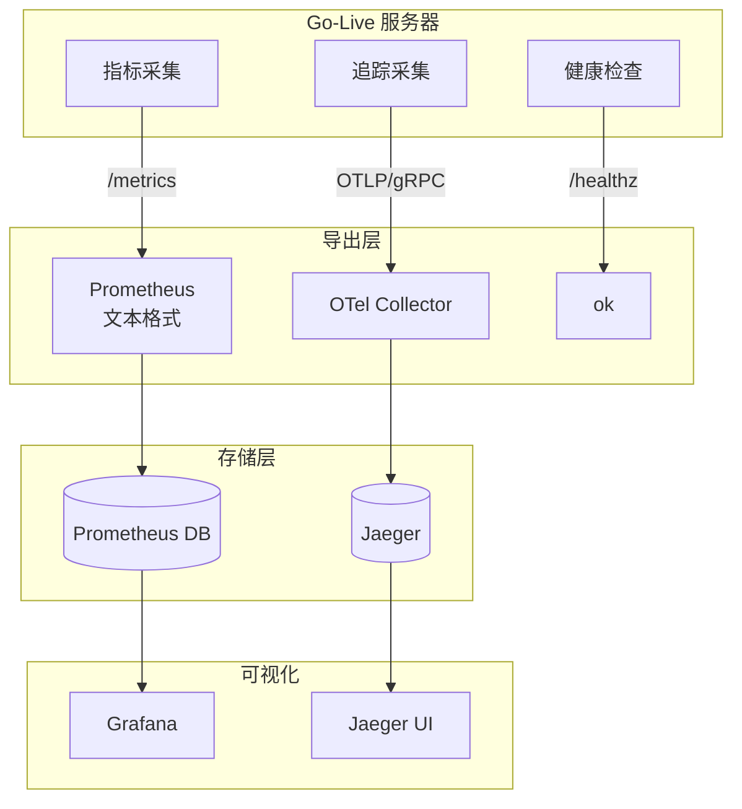

# 可观测性

Prometheus 指标、OpenTelemetry 追踪和健康检查。

## 可观测性架构



## Prometheus 指标

### 端点

```http
GET /metrics
```

### 可用指标

| 指标 | 类型 | 标签 | 说明 |
|------|------|------|------|
| `live_rooms` | Gauge | - | 活跃房间数 |
| `live_subscribers` | GaugeVec | `room` | 每房间订阅者数 |
| `live_rtp_bytes_total` | CounterVec | `room` | RTP 字节总数 |
| `live_rtp_packets_total` | CounterVec | `room` | RTP 包总数 |

### 示例输出

```
# HELP live_rooms Active room count
# TYPE live_rooms gauge
live_rooms 3

# HELP live_subscribers Subscribers per room
# TYPE live_subscribers gauge
live_subscribers{room="demo"} 5
live_subscribers{room="test"} 2
```

### Prometheus 抓取配置

```yaml
scrape_configs:
  - job_name: 'live-webrtc'
    scrape_interval: 10s
    static_configs:
      - targets: ['live-webrtc:8080']
```

### Grafana 面板

关键面板：

| 面板 | 查询 | 可视化 |
|------|------|--------|
| 活跃房间 | `live_rooms` | Stat |
| 总订阅者 | `sum(live_subscribers)` | Stat |
| RTP 吞吐量 | `rate(live_rtp_bytes_total[1m])` | Graph |
| 包/秒 | `rate(live_rtp_packets_total[1m])` | Graph |

## OpenTelemetry 追踪

### 配置

```bash
OTEL_EXPORTER_OTLP_ENDPOINT=otel-collector:4317
OTEL_EXPORTER_OTLP_PROTOCOL=grpc
OTEL_SERVICE_NAME=live-webrtc-go
```

### 追踪的操作

| Span 名称 | 属性 |
|-----------|------|
| `HTTP {method} {path}` | `http.method`, `http.status_code`, `http.route` |
| `whip.publish` | `room`, `sdp.size` |
| `whep.play` | `room`, `sdp.size` |
| `room.create` | `room` |
| `room.close` | `room` |

## 健康检查

### 端点

```http
GET /healthz
```

响应：
```
ok
```

状态码：200 OK

### Kubernetes 探针

```yaml
livenessProbe:
  httpGet:
    path: /healthz
    port: 8080
  initialDelaySeconds: 5
  periodSeconds: 10

readinessProbe:
  httpGet:
    path: /healthz
    port: 8080
  initialDelaySeconds: 5
  periodSeconds: 10
```

## 调试端点

### pprof

使用 `PPROF=1` 启用：

```bash
PPROF=1 go run ./cmd/server
```

访问：
- `/debug/pprof/` - 索引页
- `/debug/pprof/heap` - 堆分析
- `/debug/pprof/goroutine` - Goroutine 分析
- `/debug/pprof/profile` - CPU 分析

### CPU 分析

```bash
# 采集 30 秒 CPU 分析
curl -o cpu.prof "http://localhost:8080/debug/pprof/profile?seconds=30"

# 分析
go tool pprof cpu.prof
```

## 故障排除命令

```bash
# 检查指标
curl http://localhost:8080/metrics | grep live_

# 健康检查
curl http://localhost:8080/healthz

# 查看 goroutines
curl http://localhost:8080/debug/pprof/goroutine?debug=1

# 内存统计
curl http://localhost:8080/debug/pprof/heap?debug=1 | head -20
```
