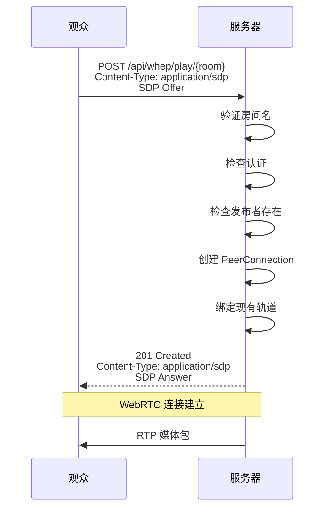
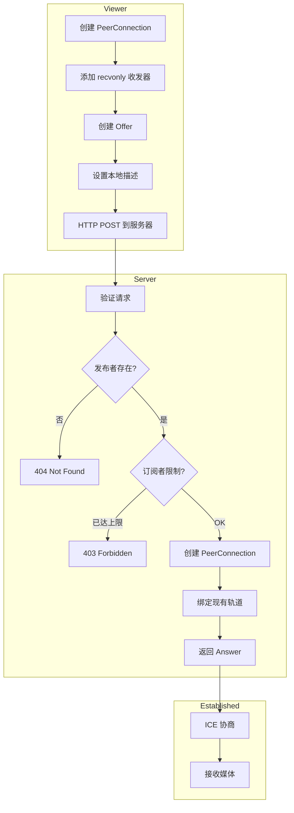

# WHEP 协议

WHEP (WebRTC-HTTP Egress Protocol) 用于订阅媒体流。

## 概述



## 端点

```http
POST /api/whep/play/{room}
Content-Type: application/sdp
Authorization: Bearer <token>
```

### 参数

| 参数 | 位置 | 类型 | 说明 |
|------|------|------|------|
| `room` | path | string | 房间名（1-64 字符，`A-Za-z0-9_-`） |

### 响应码

| 状态码 | 说明 |
|--------|------|
| 201 | 成功 - 返回 SDP Answer |
| 400 | 无效的房间名或 SDP |
| 401 | 认证失败 |
| 403 | 订阅者数量已达上限 |
| 404 | 房间无活跃发布者 |
| 429 | 请求频率超限 |

## 连接流程



## 浏览器示例

```javascript
// 获取 ICE 配置
const config = await fetch('/api/bootstrap').then(r => r.json());

// 创建 PeerConnection
const pc = new RTCPeerConnection({
  iceServers: config.iceServers
});

// 创建 recvonly 收发器
pc.addTransceiver('video', { direction: 'recvonly' });
pc.addTransceiver('audio', { direction: 'recvonly' });

// 处理传入轨道
const video = document.getElementById('video');
pc.ontrack = (event) => {
  video.srcObject = event.streams[0];
};

// 创建 offer
const offer = await pc.createOffer();
await pc.setLocalDescription(offer);

// 等待 ICE 收集
await new Promise(resolve => {
  if (pc.iceGatheringState === 'complete') {
    resolve();
  } else {
    pc.onicegatheringstatechange = () => {
      if (pc.iceGatheringState === 'complete') resolve();
    };
  }
});

// 发送 WHEP 请求
const response = await fetch('/api/whep/play/myroom', {
  method: 'POST',
  headers: {
    'Content-Type': 'application/sdp',
    'Authorization': 'Bearer mytoken'
  },
  body: pc.localDescription.sdp
});

if (response.ok) {
  const answer = await response.text();
  await pc.setRemoteDescription({ type: 'answer', sdp: answer });
}
```

## 错误处理

| 错误 | 原因 | 解决方案 |
|------|------|----------|
| `404 Not Found` | 房间无发布者 | 等待发布者 |
| `403 Forbidden` | 订阅者已达上限 | 增加 `MAX_SUBS_PER_ROOM` |
| `401 Unauthorized` | 无效/缺失 Token | 检查认证 |
