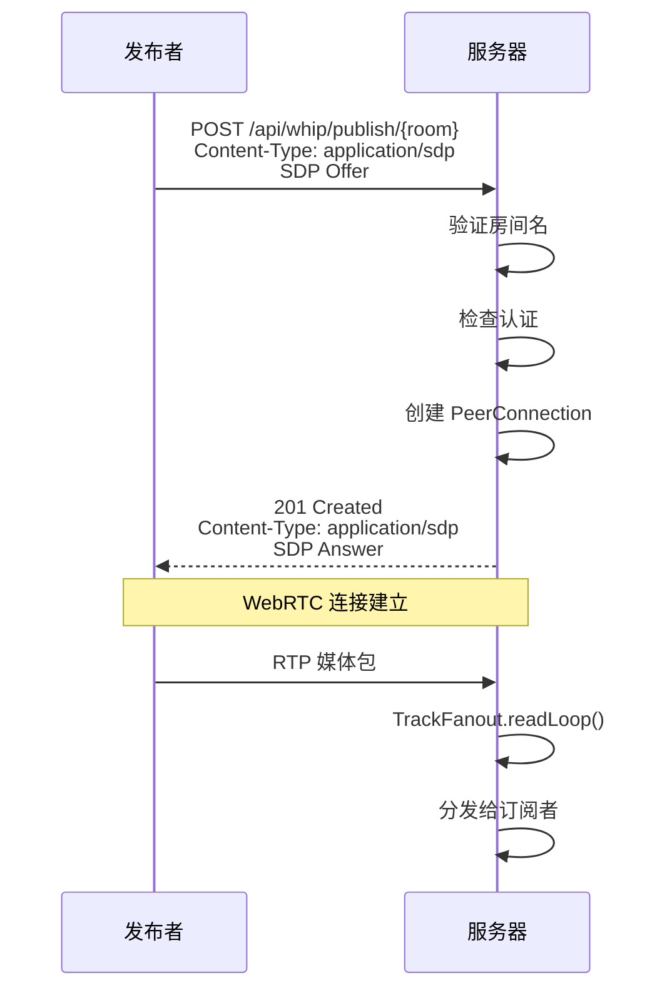

# WHIP 协议

WHIP (WebRTC-HTTP Ingestion Protocol) 用于发布媒体流。

## 概述



## 端点

```http
POST /api/whip/publish/{room}
Content-Type: application/sdp
Authorization: Bearer <token>
```

### 参数

| 参数 | 位置 | 类型 | 说明 |
|------|------|------|------|
| `room` | path | string | 房间名（1-64 字符，`A-Za-z0-9_-`） |

### 响应码

| 状态码 | 说明 |
|--------|------|
| 201 | 成功 - 返回 SDP Answer |
| 400 | 无效的房间名或 SDP |
| 401 | 认证失败 |
| 409 | 房间已有发布者 |
| 429 | 请求频率超限 |

## OBS 配置

1. 打开 OBS Studio
2. 进入 设置 → 流
3. 服务：选择 "WHIP"
4. 服务器：`http://your-server:8080/api/whip/publish/{room}`
5. Bearer Token：你的认证 Token
6. 点击 "开始推流"

## 浏览器示例

```javascript
const pc = new RTCPeerConnection({
  iceServers: [{ urls: 'stun:stun.l.google.com:19302' }]
});

// 获取用户媒体
const stream = await navigator.mediaDevices.getUserMedia({
  video: true,
  audio: true
});

// 添加轨道到连接
stream.getTracks().forEach(track => {
  pc.addTrack(track, stream);
});

// 创建 offer
const offer = await pc.createOffer();
await pc.setLocalDescription(offer);

// 等待 ICE 收集
await new Promise(resolve => {
  if (pc.iceGatheringState === 'complete') {
    resolve();
  } else {
    pc.onicegatheringstatechange = () => {
      if (pc.iceGatheringState === 'complete') resolve();
    };
  }
});

// 发送 WHIP 请求
const response = await fetch('/api/whip/publish/myroom', {
  method: 'POST',
  headers: {
    'Content-Type': 'application/sdp',
    'Authorization': 'Bearer mytoken'
  },
  body: pc.localDescription.sdp
});

if (response.ok) {
  const answer = await response.text();
  await pc.setRemoteDescription({ type: 'answer', sdp: answer });
}
```

## 错误处理

| 错误 | 原因 | 解决方案 |
|------|------|----------|
| `409 Conflict` | 房间已有发布者 | 使用不同房间名 |
| `401 Unauthorized` | 无效/缺失 Token | 检查认证 |
| `400 Bad Request` | 无效房间名 | 使用 `^[A-Za-z0-9_-]{1,64}$` |
